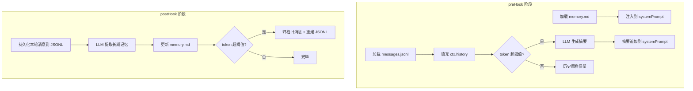

# agent-session 扩展架构文档

> **文件位置**: `src/global/extensions/agent-session.ts`
> **注册方式**: 通过 `Agent.usePreHook()` / `Agent.usePostHook()` 挂载到 ReAct 引擎生命周期

---

## 1. 概述

`agent-session` 是 AgentChat 的**默认会话持久化插件**，通过 `preHook` / `postHook` 机制介入 `Agent.run()` 的生命周期，管理对话历史、长期记忆和上下文压缩。

```
┌──────────────────────────────────────────────────────────────┐
│                     Agent.run() 生命周期                       │
│                                                              │
│  preHook ──→ ReAct Loop (tool calls) ──→ postHook            │
│  (准备上下文)      (LLM 推理 + 工具执行)      (持久化 + 记忆)    │
└──────────────────────────────────────────────────────────────┘
```

---

## 2. 两层记忆架构

插件维护两种不同生命周期的记忆，分别服务于不同的目的：

| 维度 | 摘要 (Summary) | 记忆 (Memory) |
|------|:---:|:---:|
| **触发时机** | preHook，token 超阈值时 | postHook，每轮对话都执行 |
| **触发条件** | `estimateTokens(history) > maxContextTokens` | 无条件（每轮都调用 LLM 分析） |
| **目的** | 压缩上下文，防止 LLM 窗口溢出 | 提取长期知识（偏好、决策、待办、画像） |
| **写入位置** | 临时拼接到 `systemPrompt` | 持久化到 `memory.md` |
| **生命周期** | 仅当前 `Agent.run()` 有效 | 跨会话永久保留 |
| **内容侧重** | "刚才聊了什么"（对话脉络） | "用户是谁"（用户画像） |



---

## 3. 数据模型

### 3.1 PersistedMessage（持久化消息格式）

插件内部定义的序列化格式，在 `Message`（运行时）与 JSONL（磁盘）之间转换：

```typescript
interface PersistedMessage {
  role:        'system' | 'user' | 'assistant' | 'tool';
  content:     string | null;
  agent_id?:   string;    // 来源 Agent ID，多 Agent 场景下区分消息归属
  name?:       string;    // tool 角色时提供函数名
  tool_calls?: Array<{    // OpenAI 格式的工具调用
    id: string;
    type: 'function';
    function: { name: string; arguments: string };
  }>;
  tool_call_id?:  string;
  reasoning_content?: string;  // 思维链（DeepSeek R1 等）
  label?:         string;      // 展示标签（如 "[read] 读取 /path/to/file"）
  timestamp:      string;      // ISO 8601
}
```

### 3.2 与运行时 `Message` 的映射关系

| PersistedMessage | Message | 转换说明 |
|---|---|---|
| `tool_calls[].function.arguments` (JSON string) | `tool_calls[].arguments` (parsed object) | 序列化/反序列化用 `safeJsonParse` |
| `agent_id` | `agent_id` | 透传 |
| `reasoning_content` | — | JSONL 保留但**不加载**到运行时（避免浪费 token） |
| `label` | `label` | 透传 |
| `timestamp` | — | 仅持久化层使用 |

---

## 4. 文件系统布局

### 4.1 路径规范

``` 
data/sessions/
├── <lo>/                          # Canonical Ordering：双方 ID 按字母序排序
│   └── <hi>/
│       ├── messages.jsonl         # 共享消息历史（双方读写同一文件）
│       └── archive/
│           ├── history_1.jsonl    # 归档的历史消息
│           ├── history_2.jsonl
│           └── ...
├── <agent>/                       # 非对称路径：每方私有的记忆
│   └── <counterpart>/
│       └── memory.md              # 私有长期记忆
data/usage/
└── token_<YYYY-MM-DD>.jsonl       # Token 用量记录（JSONL 按日分片）

### 4.2 Canonical Ordering（规范排序）

消息文件的关键设计原则——"**逻辑双写，物理唯一**"：

```typescript
// 双方 agent ID 按字母序排序，确保指向同一物理文件
function resolveMessagePath(agentA: string, agentB: string): string {
  const [lo, hi] = [agentA, agentB].sort();
  return path.join(sessionsDir, lo, hi, 'messages.jsonl');
}

// 但记忆文件使用方向敏感路径（每一方对同一对方的记忆是独立的）
function resolveMemoryPath(agent: string, counterpart: string): string {
  return path.join(sessionsDir, agent, counterpart, 'memory.md');
}
```

| 函数 | 用途 | 对称性 |
|---|---|---|
| `resolveMessagePath(a, b)` | 共享对话历史 | 对称 → 同一文件 |
| `resolveMemoryPath(a, b)` | 私有长期记忆 | 非对称 → 不同文件 |
| `resolveArchiveDir(a, b)` | 归档目录 | 对称 → 同一目录 |

---

## 5. preHook 流水线

> **触发时机**: `Agent.run()` 进入 ReAct 循环**之前**
> **核心职责**: 准备上下文（注入记忆 + 加载历史 + 按需压缩）

```
loadMemory(agent, counterpart)        ──→ 注入到 systemPrompt
loadHistory(agent, counterpart)       ──→ 填充 ctx.history
  ↓ token 超阈值?
generateSummary(history[:split], llm) ──→ 追加到 systemPrompt
```

### 5.1 分割策略

当 `estimateMessagesTokens(history) > maxContextTokens` 时触发压缩，分割算法：

1. 从尾部向前累积，目标保留约 `10% × maxContextTokens` 的最近消息
2. 分割点安全校验：不能拆分 `tool-call ↔ tool-response` 对
   - 若分割点落在 `tool` 消息上，向前追溯到其对应的 `assistant(tool_calls)` 消息
3. 调用 LLM 将早期消息压缩为 ≤300 字的中文摘要

**为什么摘要不注入 history 而是追加到 systemPrompt？**

`agent.ts` 构建 LLM 请求时已固定首条消息为 `system` 角色。若 history 中再出现 `system` 消息会违反 LLM 单 system 消息规范，因此将摘要合并到 `systemPrompt` 末尾。

### 5.2 角色校正

```typescript
function resolveRole(storedRole, agentId, loadingAgent) {
  if (storedRole === 'tool')   return 'tool';    // 工具消息无歧义
  if (!agentId)                return storedRole; // 旧数据兼容
  if (agentId === 'user')      return 'user';     // 人类用户万年 user
  if (agentId === loadingAgent) return 'assistant'; // 自己发出的
  return 'user';                                   // 其他 Agent 发来的
}
```

背景：`messages.jsonl` 中的 `role` 是从接收方视角记录的。例如 `chat_agent → coding_agent` 的消息在 JSONL 中为 `role="user"`（coding_agent 视角），但加载方为 `chat_agent` 时应校正为 `assistant`（自己发出的）。

---

## 6. postHook 流水线

> **触发时机**: `Agent.run()` ReAct 循环**完成后**
> **核心职责**: 持久化本轮消息 + 更新长期记忆 + 按需归档

```
1. 持久化 user 消息 (ctx.currentMessage)     ──→ messages.jsonl
2. 持久化 assistant + tool 消息 (ctx.loopMessages) ──→ messages.jsonl
3. 更新长期记忆 (LLM 提取新事实)              ──→ memory.md
4. 归档旧消息 (token 超阈值时)                ──→ archive/history_N.jsonl
5. 记录 Token 用量                            ──→ console.log
```

### 6.1 消息暂存机制

使用 `WeakMap<AgentContext, PersistedMessage[]>` 在 `preHook → postHook` 之间传递本轮新产生的消息。每个 `Agent.run()` 持有独立的 `AgentContext`，`WeakMap` 以此为键自然隔离不同会话。`AgentContext` 回收时自动清理。

```typescript
const sessionPendingMessages = new WeakMap<AgentContext, PersistedMessage[]>();
```

---

## 7. 长期记忆系统

### 7.1 工作流程

```
现有 memory.md ──→ 解析事实列表 []
本轮对话内容   ──→ LLM 提取新事实 []
         ↓
    去重合并 → 截断至 maxMemoryFacts → 序列化回 memory.md
```

### 7.2 LLM 提取 Prompt 设计

| 指令 | 说明 |
|---|---|
| 判断标准 | 偏好/习惯、重要决策/结论、待办事项、个人信息 |
| 排除项 | 纯技术性工具调用、临时文件操作 |
| 去重 | 提供已有记忆列表作为参考 |
| 无记忆时 | 回复 `NO_MEMORY` |
| 归档提示 | 若 `willArchive=true`，追加 `[会话概要]` 条目 |

### 7.3 memory.md 格式

```markdown
# ChatAgent 对 User 的记忆

- 用户偏好中文交流，喜欢简洁的回答风格
- 项目 AgentChat 需要支持多 Agent 路由
- [待办] 实现 WebSocket 断线重连机制
- [会话概要] 讨论了 agent-session 插件的归档策略
```

---

## 8. 归档机制

### 8.1 触发条件

postHook 中判断：`compressedTokens + roundTokens > maxContextTokens`

### 8.2 归档流程

```
1. 计算归档编号 (archive/ 已有文件数 + 1)
2. fs.renameSync(messages.jsonl → archive/history_N.jsonl)
3. 合并 ctx.history + 本轮暂存消息 → truncateTail() 截断至 ≤80% maxContextTokens
4. 写入截断后的消息重建 messages.jsonl
```

**关键改进**：步骤 3 使用 `truncateTail()` 主动将重建文件控制在安全水位（≤ 80% 阈值），保证下一轮 `loadHistory` 时不会立即触发压缩。`truncateTail` 从尾部向前保留近期消息，并保证不切割 tool-call ↔ tool-response 对。

### 8.3 与 preHook 压缩的分工

```
                 preHook 压缩               postHook 归档
触发阈值  ────→  相同 maxContextTokens  ←───
操作对象  ────→  ctx.history (内存)      ←──→  messages.jsonl (磁盘)
压缩方式  ────→  LLM 自然语言摘要         ←──→  物理文件移动 + truncateTail 截断
职责定位  ────→  罕见兜底（异常长单轮）    ←──→  物理保障（文件永远 ≤ 安全水位）
```

---

## 9. Token 估算

插件使用启发式算法估算 token 数，不依赖 LLM tokenizer：

```typescript
function estimateTokens(text: string): number {
  // 中文字符 ≈ 0.6 token/字
  // 英文字符 ≈ 0.3 token/字
}
```

精度说明：这是一个粗略近似值，用于阈值判断（是否超 `maxContextTokens`），不要求精确匹配 LLM tokenizer。误差在 20% 以内不影响架构决策。

---

## 10. 配置系统

### 10.1 配置优先级

```
Agent runtimeConfig (config.json)  >  全局 AppConfig  >  代码默认值
```

```typescript
function cfg(ctx?: AgentContext): AppConfig {
  const base = getGlobalConfig();
  const overrides = ctx?.runtimeConfig;
  // 浅合并 runtimeConfig 中非 undefined 的字段
  return { ...base, ...filteredOverrides };
}
```

### 10.2 本插件涉及的配置项

| 配置键 | 默认值 | 用途 |
|---|---|---|
| `maxContextTokens` | — | 归档截断 + preHook 压缩的统一阈值（归档使用 80% 子水位） |
| `maxMemoryFacts` | — | 记忆事实条数上限 |
| `sessionsDir` | — | 会话数据根目录 (`data/sessions`) |
| `agentsDir` | — | Agent 配置根目录 (`data/agents`) |

---

## 11. 与核心引擎的集成

```typescript
// 注册方式（在 Agent 初始化时）
const agent = new Agent({ agentId, systemPrompt, ... });
agent.usePreHook(preHook);    // 来自 agent-session.ts
agent.usePostHook(postHook);  // 来自 agent-session.ts
```

### AgentContext 字段使用矩阵

| 字段 | preHook 读取 | preHook 写入 | postHook 读取 | 说明 |
|---|---|---|---|---|
| `sender` | ✅ | | ✅ | 消息来源方 |
| `receiver` | ✅ | | ✅ | 消息接收方（= Agent ID） |
| `systemPrompt` | ✅ | ✅ | | 注入记忆和摘要 |
| `history` | | ✅ | ✅ | 填充历史 + 压缩后替换 |
| `currentMessage` | | | ✅ | 持久化用户消息 |
| `loopMessages` | | | ✅ | 持久化 assistant + tool 消息 |
| `runtimeConfig` | ✅ | | ✅ | per-agent 配置覆盖 |
| `llm` | ✅ | | ✅ | 摘要生成 + 记忆提取 |
| `cumulativeUsage` | | | ✅ | 记录 Token 用量 |

---

## 12. 导出 API

| 导出 | 类型 | 用途 |
|---|---|---|
| `preHook` | `PreProcessHook` | 挂载到 `Agent.usePreHook()` |
| `postHook` | `PostProcessHook` | 挂载到 `Agent.usePostHook()` |
| `PersistedMessage` | `interface` | JSONL 序列化格式 |
| `resolveMessagePath` | `(agentA, agentB) => string` | 外部模块复用路径计算 |
| `resolveMemoryPath` | `(agent, counterpart) => string` | 外部模块复用路径计算 |

---

## 13. 设计决策与权衡

### 13.1 临时缓存 vs 文件存储

| 数据 | 存储方式 | 原因 |
|---|---|---|
| 摘要 | 内存（systemPrompt 字符串） | 仅当前 run 有效，无需持久化 |
| 记忆 | 文件（memory.md） | 跨会话知识，必须持久化 |
| 本轮消息暂存 | WeakMap（内存） | preHook→postHook 的临时桥梁 |

### 13.2 reasoning_content 不加载到运行时

DeepSeek R1 等模型的思考内容（`reasoning_content`）在 JSONL 中保留用于调试和 UI 展示，但刻意不加载到 `ctx.history`。原因：
- 思考内容是针对当前问题的临时草稿，跨轮次传入浪费大量 token
- DeepSeek 官方也建议不要跨轮传入

### 13.3 agentLabel 缓存

`agentLabel()` 通过 `Map<string, string>` 缓存 Agent 友好名称，避免每次调用都读取 `config.json` 解析。

### 13.4 safeJsonParse

`PersistedMessage.tool_calls[].function.arguments` 存储为 JSON 字符串，反序列化时使用容错解析：失败返回 `{}` 而非抛异常。

### 13.5 分割点安全校验

`truncateTail()` 与 `preHook` 压缩共享同一安全校验逻辑：不切割 `tool-call ↔ tool-response` 对。若分割点落在 `tool` 消息上，向前追溯到对应的 `assistant(tool_calls)` 消息作为新的分割点。

### 13.6 归档截断策略

`archiveAndRebuild` 使用 80% `maxContextTokens` 作为安全水位：
- **为什么是 80%？** 给下一轮新增消息留出 20% 的缓冲空间，避免单轮对话就立即触发归档
- **为什么用截断而非 LLM 摘要？** 磁盘文件不需要自然语言可读性，直接丢弃最旧消息效率最高
- **与 preHook 的关系**：归档截断 = 物理保障（文件永远 ≤ 80%），preHook 压缩 = 逻辑兜底（异常长单轮消息）

---

## 14. 日志输出

插件通过 `console.log` / `console.warn` 输出以下关键事件：

| 事件 | 日志前缀 |
|---|---|
| 上下文压缩完成 | `[agent-session] 上下文已压缩` |
| LLM 摘要生成 | `[agent-session] LLM 摘要生成成功` |
| LLM 摘要失败 | `[agent-session] LLM 摘要返回空内容` |
| LLM 提取记忆 | `[agent-session] LLM 提取记忆` |
| 归档完成 | `[agent-session] 已归档` |
| 归档截断 | `[agent-session] 归档重建截断` |
| Token 用量 | `[agent-session] Token 用量` |
| Token 持久化 | → `data/usage/token_<YYYY-MM-DD>.jsonl` |
