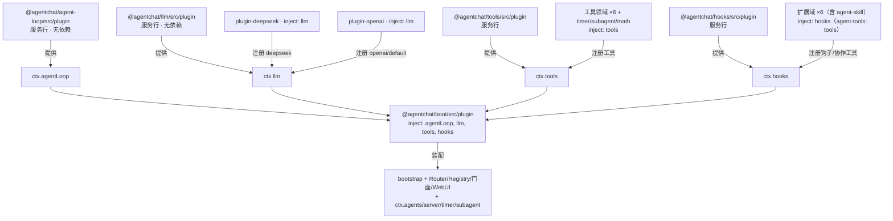

# AgentChat Preview 知识库（项目状态权威文档）

> 最后更新：2026-08-15（续·九） · 用途：上下文恢复/交接/继续开发的唯一权威依据。
> 覆盖：双轨决策、45 包契约化架构、阶段历程（迁移五阶段 + 契约化①~⑤ + gap 块 A~D）、核心机制、踩坑记录、验证基线、未完成清单。
>
> ▶ **当前状态（2026-08-15 续·九）**：**L1/L2/L3 全部完成，P5.5 收尾通过**——
>    · 块 A：boot 只做契约接线（`ctx.bootstrap`/`ctx.l4`/`ctx.timerManager`；workspace/archive/timer/subagent/server 服务行各自构造 Manager；`bootstrap.ts` L4 `new` 清零）。
>    · 块 B：`ctx.http`（HttpRouteRegistry）注册式 HTTP 路由；WebUIServer 只挂中间件/WS/SPA fallback。
>    · 块 C：静态行 HMR（vendor `@agentchat/cordis-timer` + `--expose-internals`，改 packages/*/src 热生效）。
>    · 块 D：P5.5 完成（iframe isolated 档 + global-style 前缀重写 + 生产 CSP 审计；真 Edge headless 验收）。
>    · 基线：`pnpm typecheck` 0 错误、`pnpm test` **406/406**、WebUI 包 `vue-tsc/tsc/build` 全过。
> ▶ **下一 session 唯一主线：块 E（方向 D：preview 整体切换 src）**；详情见 `docs/everything-plugin-gap-plan.md`。

---

## 1. 项目概况

- **AgentChat**：Node.js + TypeScript 多 Agent 协作框架（原 5 层架构：core→agents→plugins→services→app）。
- **双轨重构决策**（用户 2026-08-13 定）：新建 `preview/` 轨道，**cordis 4 + pnpm monorepo 全量重写**；稳定后整体切到 `src/`。旧轨（根目录 src/）只修 bug，新功能只进 preview。
- **理念**（用户）：一切皆插件；目的：让 Agent 自我进化。
- **基座**：cordis 全家桶已本地 vendor 到 `preview/vendor/*` 并改别名 `@agentchat/cordis` / `@agentchat/cordis-loader` / `-include` / `-hmr` / `-timer` / `-logger` / `@agentchat/cosmokit` / `@agentchat/schemastery`（8 包，可直接改 src/lib）；升级用 `preview/scripts/vendor-deepseek.mjs`。

## 2. 架构总览（33 个 @agentchat/* 包）

```
依赖根：types（AgentMessage 唯一消息契约/工具定义）· protocol（跨端契约）
  ↑ llm（LLM 适配器工厂 + ChatStream；消息契约直连 types）
  ↑ agent-loop（ReAct 引擎 run(ctx) + 中断 + CurrentContext；消息/工具契约直连 types）
  ↑ tools（工具注册中心 ctx.tools）· hooks（钩子注册中心 ctx.hooks，由 ext 更名）
  ↑ agent-config（单 Agent 配置契约：AgentConfig/AgentPlugin/collect*/resolveAgentDir）
  ↑ agents（AgentAssembly/createAgentContext/Registry） router（RouterMessage 路由协议/群组/虚拟 Agent）
  ↑ toolkit（工具基础：defineTool/表单 Schema/命名空间/沙箱路径/token 文本）
  ↑ edit（编辑引擎：hashline DSL/增量 diff/快照）
  ↑ 工具领域包：fs（read/write）shell（bash）web（web_search/browser+4 providers）
    dev（code_search/read_logs/reload/register_tool）session-tools（会话工具）app-tools（应用管理）math（vm 沙箱）
  ↑ 扩展域包：agent-prompt（build-system-prompt）agent-skill（discovered_skills 技能注入）
    agent-session agent-memory agent-mcp security agent-tools
  ↑ svc：timer（5 种调度+chime）subagent archive backup
  ↑ server（WebUIServer HTTP/WS/JSON-RPC + L4 门面）
  ↑ boot（装配根：bootstrap/loader/plugin/register-core/shutdown/supervisor）
```

- 依赖**值级单向无环**。包环（agents↔router、tools↔8 领域包、hooks↔扩展域、router→agent-config、protocol→types）反向边全部为 `import type`，编译期擦除——环详情见 §2.1.5。
- 契约化分层（2026-08-15 最终态）：
  ```
  0  logger                1  types · protocol · llm
  2  tools · hooks · agent-loop
  3  agent-config · agents  4  router
  5  工具/钩子实现（含 agent-skill）  6  server · boot · ui
  ```
- 每个插件包：`src/`（实现）+ `plugin.ts`（cordis apply+inject）；契约包无 plugin；运行时库由 boot 装配。
- 包间用包名 + workspace 链接；`tsconfig paths` 直连源码；运行时 tsx 直跑 TS。

### 2.1 插件依赖图（全量核对 · 2026-08-15）

> 口径：各包 `package.json` 的 `workspace:*` 声明 + src/tests 实测 `import` 交叉核对。
> 全量口径（含 boot）：**33 包 / 165 条声明边**（值 94 / 类型 63 / 仅测试 3 / 未使用 0）。
>   P1 已修复 gen-deps 注释清洗顺序问题（`skills/*/SKILL.md` 被误判为块注释导致 agent-skill 5 条误报），未使用声明归零。
> 结论：**值级单向无环**（DAG）。
> 交互图：`docs/preview-plugin-deps.html`（由 `preview/scripts/gen-deps-graph.mjs` 生成，随代码可重跑）。
>   **图 1 默认排除 `boot`**（装配聚合根，扇出过大遮蔽分层；运行时装配关系见图 2）——
>   排除后口径：32 包 / 144 条声明边（值 76 / 类型 65 / 仅测试 3 / 未使用 0）。

#### 2.1.1 两种依赖图

| 视角 | 载体 | 节点 | 边 | 决定什么 |
|---|---|---|---|---|
| 静态包依赖图（图 1） | 各包 `package.json` + src/tests `import` 分类 | 33 个 `@agentchat/*` 包 | X 依赖 Y（166 条；值/类型/仅测试/未使用） | pnpm 安装顺序、构建/类型检查——**与 inject 无关** |
| 运行时插件组合图（图 2） | `cordis.yml` + 各包 `plugin.ts`（name/inject/apply）+ `registerCoreServices` | 插件行 / 嵌套插件 / Service | 服务提供 + `inject` 消费 | 进程激活顺序、Service 依赖 |

> 图 1 回答“代码里谁 import 谁”（编译期）；图 2 回答“运行期谁提供/消费什么服务”（inject）。

#### 2.1.2 契约归属（无兼容模式）

| 契约 | 归属 | 说明 |
|---|---|---|
| `AgentMessage` / `MessageRole` / `ToolCall` / `PersistedToolCall` / `LLMRequestMessage` / `ToolDefinition` / `ToolStream` | `@agentchat/types` | 唯一消息契约，无 `Message` 别名；llm/agent-loop 均直连、不再 re-export |
| `PersistedMessage` / `PersistedRole` / `GroupPersistedMessage` / `AgentInfo` / `GroupInfo` / `PluginMeta` | `@agentchat/protocol` | 跨端/持久化 DTO；`ToolCall` 对齐 `types.PersistedToolCall` |
| `LLMConfig` / `LLMProvider` / `LLMRequest` / `LLMResponse` / `LLMUsage` / `StreamToken` / `ChatStream` | `@agentchat/llm` | `LLMProvider.toProviderMessages/fromProviderMessages` 负责消息转换 |
| `Tool` / `ToolContext` / `PluginServices` / `ToolsService` | `@agentchat/tools` | 工具执行契约与注册中心；`ToolDefinition` 归 types |
| `HooksService` / `HookNames` / `HookFactory` / `ResolvedHooks` / `PluginHooks` | `@agentchat/hooks` | 钩子注册中心；钩子函数签名仍由 agent-loop 定义并 re-export |
| `CurrentContext` / `RunResult` / `AgentResult` / `CoreEventType` / `InterruptReason` / `AgentLoopEngine` | `@agentchat/agent-loop` | 引擎契约，自身无 inject |
| `AgentConfig` / `AgentPlugin` / `HookNames` / `collectToolNames` / `collectHookNames` / `getNamespaceConfig` / `resolveAgentDir` | `@agentchat/agent-config` | 单 Agent 配置契约；`agents` 不再 re-export，消费方直连 |
| `SkillManifest` / `parseSkillFrontmatter` / `discoverSkills` / `buildSkillsBlock` / `makeInjectSkillsHook` | `@agentchat/agent-skill` | 技能域契约与 `discovered_skills` 钩子实现 |
| `RouterMessage` / `GroupMessage` / `TriggerOptions` | `@agentchat/router` | 路由协议消息，区别于 types 的 `AgentMessage` |

#### 2.1.3 包依赖分层图（↑ = 依赖下层；† = 仅 `import type`）

```
层0  根（零依赖）   types（AgentMessage/工具定义）      protocol（跨端契约）
                   util（logger/supervisor）
层1  LLM           llm ── types, util
层2  ReAct 引擎    agent-loop ── types, llm, util
层3  配置/钩子     agent-config ── agent-loop, llm       hooks ── agent-loop, tools†
层4  单 Agent      agents ── agent-config, agent-loop, llm（AgentRouterLike 最小契约，不再 import router）
层5  路由/工具基础  router ── agent-config, agents, llm
                   toolkit ── agent-config, agents       edit ── toolkit, agent-config
层6  工具注册中心  tools ── toolkit, agents, agent-loop
层7  工具领域包    fs/shell/web/dev/session-tools/app-tools/math ── toolkit, tools†
层8  扩展域包      agent-prompt ── agent-config, hooks†      agent-skill ── agent-config, hooks†
                   agent-session/agent-memory/agent-mcp/security ── hooks†     agent-tools ── tools†
层9  服务          timer ── router†, tools†       subagent ── agent-loop†, tools†
                   archive ── agent-session, toolkit, protocol†, agent-loop†, agent-config
                   backup ── toolkit
层10 宿主          server ── archive, backup, router, agent-session, tools, toolkit,
                             protocol†, agent-loop, agents, llm, timer†, util
层11 装配          boot ── server, tools, hooks, timer, subagent, agent-prompt, agent-session,
                             agent-skill, security, agent-mcp, agent-memory, shell, toolkit, math,
                             router, agents, agent-loop, llm, types, util
层12 示例          hello（链路验证，零依赖）
```

**值级主干链**：`types`/`util`/`protocol` → `llm` → `agent-loop` → `agent-config`/`hooks` → `agents` → `router`/`toolkit`/`edit` → `tools` → 工具/扩展实现 → svc → `server` → `boot` → `hello`。

#### 2.1.4 运行时插件组合图（cordis 激活图 · 25 行）



> cordis.yml（25 行）仅声明行列表；行序不决定激活顺序（见 §2.1.7）。

要点：
- **无兼容收尾**：`@agentchat/ext` 已删除；`hooks` 为唯一钩子注册中心；`agents`/`router` 不挂行，由 boot 装配；`types`/`protocol`/`agent-config` 不进 cordis.yml。
- **契约耦合**：行间以服务契约耦合（`new XxxService(ctx)` 提供 + `inject` 消费）；`Assembly.engine`/`SubAgentManager(engine)` 均经 `ctx.agentLoop` 注入。
- **适配器行**：deepseek/openai 独立成行，经 `ctx.llm.registerAdapter` 注册。
- **boot 装配行**：`inject: ['agentLoop','llm','tools','hooks']`；Loader 场景跳过 registerCoreServices，registerCoreServices 保留为无 Loader 惰性 ctx 兜底。

#### 2.1.5 环、特殊边与未使用声明

**类型级同层/反向边 5 条（均为 `import type`，值级 DAG）**

| 边 | 说明 |
|---|---|
| hooks → agent-config / hooks → tools | hooks 服务引配置与工具契约类型 |
| protocol → types | protocol 复用 `PersistedToolCall` |
| tools → subagent / tools → timer | `PluginServices` 引 Manager 类型 |
| 工具领域 ×9 → tools | 各 `import type { ToolsService }`（图 1 列序下为正向，不计反向） |
| 扩展域 ×5 → hooks | 各 `import type { HooksService }`（同上） |

- **agents ↔ router 环已消除（P3）**：`agents/src/service.ts` 改为本地 `AgentRouterLike` 最小契约（`getRegistry()`），不再 `import type { AgentRouter } from '@agentchat/router'`，pnpm workspace 环警告中该组消失。
- **值环已消除**：原 `session-tools→tools`（路径助手）已下沉 `toolkit`；契约化⑤进一步移除 `llm/agent-loop` 对 types 的 re-export、删除 ext、agents 不再 re-export agent-config。
- **服务消费边**：`server/agent-service.ts` 的 `createLLM` 优先 `ctx.llm.create`（无 ctx 场景回退直连工厂）。
- **未使用声明 0 条**：P1 修复 gen-deps 注释清洗顺序（行注释先删，避免 `skills/*/SKILL.md` 误判块注释吞掉 import）；历史残留已清理。

#### 2.1.6 依赖图维护规则

1. **契约归属**：消息/工具定义只从 `@agentchat/types` 导入；`AgentConfig` 等只从 `@agentchat/agent-config` 导入；不要经 `agents`/`llm` 间接 re-export。
2. **包间引用**：新依赖写进 `package.json`（或跑 `preview/scripts/scan-deps-all.mjs` 自动补）；领域包→tools/hooks 只允许 `import type`。
3. **图同步**：改包/依赖后重跑 `node preview/scripts/gen-deps-graph.mjs`。
4. **新增工具领域包**：`registerXxx(tools)` + `plugin.ts`（`inject: ['tools']`）+ cordis.yml 行 + 根 package.json 声明。
5. **新增扩展域包**：`registerXxx(hooks)` + `plugin.ts`（`inject: ['hooks']`）+ cordis.yml 行 + 根 package.json 声明。
6. **新增能力服务行**：独立成行 + boot/register-core 同构挂载（必须传模块对象而非裸 apply；`await ctx.plugin()`）。

### 2.1.7 cordis.yml 行序语义（为什么行序不重要）

**结论**：行序不决定激活顺序。Loader **并发**初始化所有行；每个插件的 `apply()` 何时执行由 **`inject` 服务依赖**驱动。服务注册在**共享注册表**（root isolate symbol），跨行可见。25 行任意打乱，boot 仍在四个核心服务就绪后才启动。

**行序实际影响的仅 4 件事**：
1. 同波无依赖插件的 apply 启动顺序大体按行序 kick off（日志顺序不保证）；
2. patch 覆盖层按序应用；
3. include `!!js` 表达式在挂载时求值；
4. 人类可读性约定（提供行在前、消费行在后）。

## 3. 阶段历程（迁移五阶段 + 契约化①~⑤）

### 阶段一：逐包迁移（src → preview，18 包）
protocol → llm → util → agent-loop → agents → router → tools → ext → svc(4) → server → plugins → boot → bootstrap；333 测试全绿 + dev 跑通。

### 阶段二：cordis 化
`ctx.llm`/`ctx.tools`/`ctx.hooks`/`ctx.agents`/`ctx.server`/`ctx.timer`/`ctx.subagent` 七个 Service；`ctx.plugin()` 必须 await。

### 阶段三：全面 cordis 化
bootstrap 惰性 ctx；Assembly 回退删除；L4 门面服务化；真实消息流端到端。

### 阶段四：一切皆插件（30 包领域拆分）
tools 领域拆分（toolkit/edit/fs/shell/web/dev/session-tools/app-tools/math）；ext 扩展域拆分（agent-prompt/agent-session/agent-memory/agent-mcp/security/agent-tools）；PluginRegistry 移除；装配 100% 经 cordis。

### 阶段五：Agent 自我进化闭环
`register_tool`：vm 沙箱编译 → `ctx.tools.register` → 热生效。

### 阶段六①~④：契约化（行化/审计/可替换后端/全量行化）
能力插件全部挂 cordis.yml 行；boot 瘦身为装配行；llm 适配器独立行；工具/扩展域各自成行；agent-loop 契约化为 `ctx.agentLoop`。

### 阶段六⑤：契约化重建 + 无兼容收尾（2026-08-15）
- 新增契约包：`@agentchat/types`（`AgentMessage` 唯一消息契约）、`@agentchat/agent-config`（配置契约 + `resolveAgentDir`）。
- `@agentchat/ext` → **删除**；钩子注册中心更名为 `@agentchat/hooks`（contracts/service/hooks 目录/plugin 全部迁入）。
- 抽出 `@agentchat/agent-skill`：技能发现/解析/渲染 + `discovered_skills` 钩子独立成行。
- 无兼容清理：`llm`/`agent-loop` 不再 re-export types；`agents` 不再 re-export agent-config，全部直连；旧 `Message` 别名删除，路由协议消息独立为 `RouterMessage`；未使用 workspace 依赖清理。
- cordis.yml 25 行；依赖图 33 包 / 165 声明边（值 94 / 类型 63 / 未使用 0）；typecheck 零错误 + 318/318 + dev Ready。

### 阶段六⑥：P0~P3 收尾（2026-08-15）
- **P0 依赖图图 2 更新**：gen-deps-graph 的 cordis 运行时组合图更新为最终 25 行（hooks 注册中心 + 扩展域 ×7 含 agent-skill + agent-tools 注册工具边）。
- **P1 修复 agent-skill 误报**：注释清洗改为先删 `//` 行注释再删 `/* */`，避免 `skills/*/SKILL.md` 被误判为块注释起点吞掉 import；未使用声明归零。
- **P2 真实 LLM 验证（临时 API Key）**：deepseek-chat 真实 chat/stream 通过；适配器行注册链（ctx.llm → plugin-deepseek/openai）通过；完整 ReAct loop 真实调用 echo 工具通过；agent-skill 发现/渲染/注入通过。
- **P3 清理**：agents↔router 类型级环消除（`AgentRouterLike` 最小契约）；`WebUIServer.start()` 幂等（已监听返回端口 / 启动中复用 Promise）；`BootstrapResult.webui` 强类型为 `WebUIServer | null`。

## 4. 核心机制速查

- **registerCoreServices(ctx)**（boot/register-core.ts）：与 cordis.yml 同构挂载 agent-loop/llm/2 适配器/tools/6 工具域/hooks/7 扩展域（含 agent-skill）/timer/subagent/math。
- **LLM 消费契约**：Assembly.createLLM 全程经 `ctx.llm.create`；AgentService.createLLM 优先 `ctx.llm.create`。
- **引擎契约**：`ctx.agentLoop`（run/createContext/pushSteer）注入 `AgentAssembly.engine` 与 `SubAgentManager(engine)`。
- **消息契约**：`@agentchat/types.AgentMessage` 是唯一领域消息；`RouterMessage` 是路由协议消息；两者不混用。
- **配置契约**：`@agentchat/agent-config`（AgentConfig/AgentPlugin/collect*/resolveAgentDir），不经过 `agents` re-export。
- **能力插件注册链**：领域包 `register.ts` → `plugin.ts`（inject）→ cordis.yml 行（registerCoreServices 同构兜底）。
- **工具工厂签名**：`(config: AgentConfig, services: ToolContext) => Tool[]`。
- **钩子注册**：`ctx.hooks.register(kind, name, factory)`（kind: runStart/runEnd/stepStart/stepEnd/toolExecutionStart/toolExecutionEnd/fallback）；钩子名规范为 `<插件名>.<钩子>`（如 `agent-prompt.build-system-prompt`、`hooks.log-tool`）。
- **首次运行默认 admin**：目录与 id 均为 `admin`；`tags: ['admin','dev','agent','conductor']` 覆盖全部自带工具 requires，`plugins` 不再声明 tools（由 tags 自动注入）。
- **AgentAssembly**：装配接口（engine/createLLM/resolveTools/loadHistory/resolveHooks/systemPrompt/emit/redactResult/...）→ boot/loader 的 makeAgentAssembly 实现，deps 类型为 `AgentAssemblyDeps`。
- **loop.run(ctx)**：ReAct 纯函数；CurrentContext 用 `AgentMessage` 承载 steer/currentMessage。

## 5. 踩坑记录（避免重蹈）

1. PowerShell `\n` 字面 → Node 脚本处理文件。
2. CRLF 行尾 → 先 `replace(/\r\n/g,'\n')`。
3. JSON BOM → 去掉再 parse。
4. `mkdirSync(recursive) || writeFileSync` 短路 → 分号分隔。
5. `String.replace` 只替第一处 → split/join。
6. `copyFileSync` 不建目录。
7. `includes('PluginServices')` 被注释命中 → 精确字符串检查。
8. “加依赖”脚本插重复 JSON 键 → JSON.parse+对象操作。
9. `ctx.plugin()` 异步激活 → 必须 await。
10. PBKDF2 600k 迭代 → `testTimeout: 15000`。
11. esbuild postinstall 被 pnpm 拦截 → `allowBuilds: { esbuild: true }`。
12. ESM 无 require。
13. tsconfig 含 tests → 测试类型错误暴露。
14. `ctx.plugin()` 传裸 apply 丢 inject → 必须传模块对象。
15. cordis.yml 行包必须声明在根 package.json。
16. **类型全局重命名不要用宽正则**：`\bMessage\b` 会把 router 的本地 `interface Message` 与领域 `AgentMessage` 混名——路由协议消息最终独立命名为 `RouterMessage`。
17. **兼容别名会制造声明合并冲突**：ext 与 hooks 同时 `declare module Context.hooks` 会 TS2717——无兼容模式下直接删除旧包，不要留 alias。
18. **preview 的 WebUI 静态目录不能依赖 cwd**：preview 从 `preview/` 启动，原默认 `path.resolve(process.cwd(),'src/ui/webui/dist')` 会指向不存在的 `preview/src/...`，首页空白。已改为用 `import.meta.url` 推导仓库根 `<repo>/src/ui/webui/dist`；若你从其他 cwd 启动，优先显式传 `staticDir`。
19. **WS 入站 async handler 必须显式 catch**：`ws.on('message', () => this.handleIncoming(...))` 若不 catch，处理异常会成为 unhandledRejection，配置 API Key / 发送消息后进程退出（ELIFECYCLE -1）。已在 handleConnection 统一 catch 并回传 error 消息。
20. **agent.list 依赖派生路径与 viewerId**：配置热重载后 `globalConfig.agentsDir/viewerId` 若缺失，`resolveAgentAvatar` / `HistoryService.query` 会以 undefined 调 `path.join`。已在两处加类型守卫（agentsDir 非 string 跳过头像、from/to 非 string 返回空历史，viewerId 缺省 `user`）。

## 6. 验证基线（2026-08-15）

```
✅ pnpm typecheck → 零错误（33 包 + tests）
✅ pnpm test      → 318/318 通过（39 文件）
✅ pnpm dev       → cordis 4 bin.js → cordis.yml（25 行）→ boot → WebUI listen → Ready
✅ 真实 LLM        → deepseek-chat：chat / stream / 适配器行 / 完整 loop（echo 工具）/ agent-skill 注入 全部通过
✅ 依赖图          → node scripts/gen-deps-graph.mjs（含 boot 全量 33/165；图 1 排除 boot 后 32/144；未使用 0）
```

## 7. 未完成 / 下一步

- **学习/设计交接**：见 `docs/preview-next-session.md`（cordis 能力结论 + register_plugin / per-Agent cordis.yml / 可选依赖三个方向）。
1. **整体切换 src**：preview 稳定后把 packages 提升替换 src/。
2. **闭环深化**：沙箱白名单升级；注册工具持久化；Agent 写代码文件 → register_plugin 加载；ToolsService 的 replace/unregister/owner 语义。
3. **端到端真实会话**：用持久化 API Key + 工作区配置跑一次 bootstrap 全链路真实会话（当前 P2 为隔离脚本级验证）。
4. **可选清理**：tools→agents/toolkit 的值级“工具注册中心依赖上层路径助手”可下沉到独立契约包；gen-deps 的 `EXCLUDE_FROM_PACKAGE_GRAPH` 目前硬编码 boot。
5. **Supervisor 42 重启**：代码已迁，未实测。
6. **文档索引**：`docs/cordis-migration-research.md`、`docs/cordis-granularity-analysis.md`、`docs/cordis-minimality-audit.md`、`docs/preview-contract-rebuild-plan.md`、`docs/preview-next-session.md`、本文件、`preview/README.md`、`preview/vendor/README.md`。

## 8. 关键文件清单

- `preview/cordis.yml`（组合：25 行——logger + agent-loop/llm(含 2 适配器行)/tools/hooks 服务行 + 工具领域 ×6 + 扩展域 ×7（含 agent-skill）+ timer/subagent/math + boot + hello）
- `preview/vendor/*`（本地 cordis vendor 7 包：@agentchat/cordis / cordis-loader / cordis-include / cordis-hmr / cordis-logger / cosmokit / schemastery）
- 契约包：`packages/core/types/src/index.ts`（AgentMessage）、`packages/sdk/protocol/src/index.ts`、`packages/core/agent-config/src/index.ts`
- 插件行：`packages/{core/agent-loop,core/llm,core/tools,core/hooks,math,fs,shell,web,dev,session-tools,app-tools,agent-prompt,agent-skill,agent-session,agent-memory,agent-mcp,security,agent-tools,svc/timer,svc/subagent}/*/src/plugin.ts`（+ llm 的 plugin-deepseek/plugin-openai）
- `preview/packages/boot/boot/src/{register-core,plugin,bootstrap,loader}.ts`（装配核心；`AgentAssemblyDeps`）
- `preview/packages/core/hooks/src/{service,hooks}.ts`（HooksService / BUILTIN_HOOK_CATALOG）
- `preview/packages/tools/tools/src/{service,contracts}.ts`（ToolsService/PluginServices）
- `preview/packages/core/agent-loop/src/{service,loop,context,contracts}.ts`（AgentLoopService / ReAct 引擎 / AgentMessage 消费）
- `preview/packages/agent-skill/agent-skill/src/{skills,register,plugin}.ts`（技能域）
- `preview/packages/dev/dev/src/register-tool.ts`（自我进化闭环）
- `preview/scripts/*.mjs`（迁移/修复脚本族：migrate-*、p3~p9-*、scan-deps-all、gen-deps-graph）
- `docs/preview-plugin-deps.html`（交互依赖图）
- `docs/preview-next-session.md`（下一会话学习/设计交接）
- `preview/vitest.config.ts`（testTimeout 15s）
