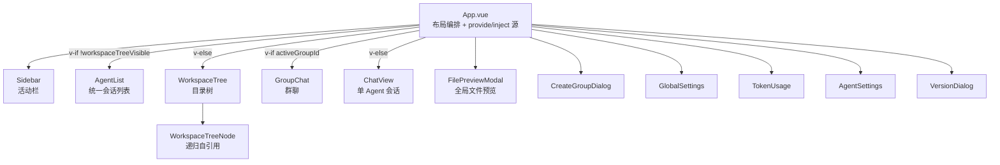
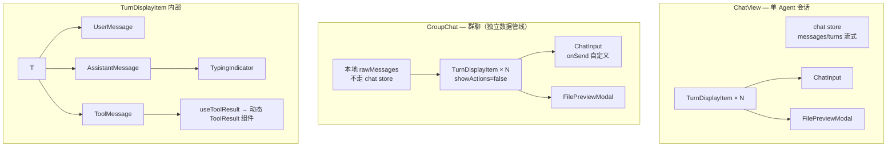
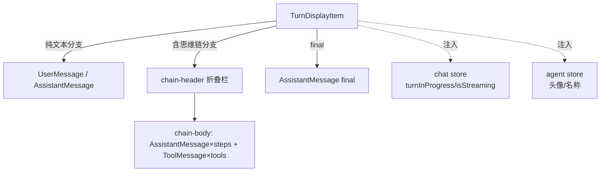
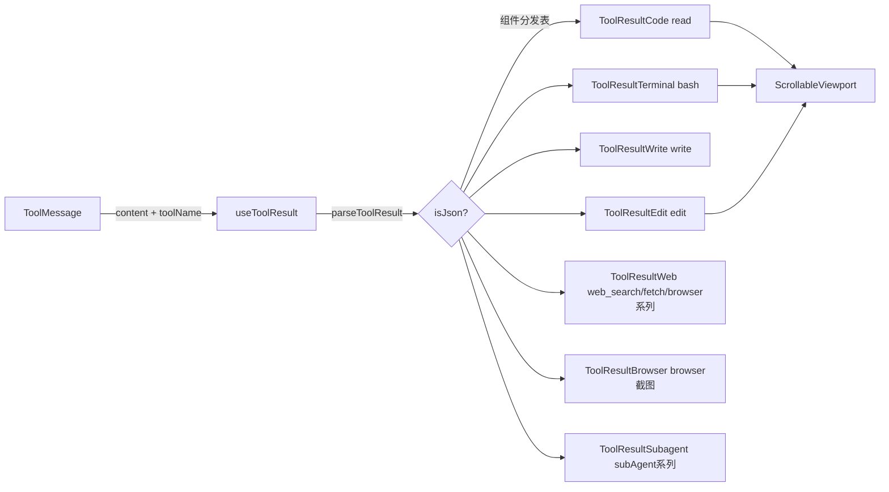
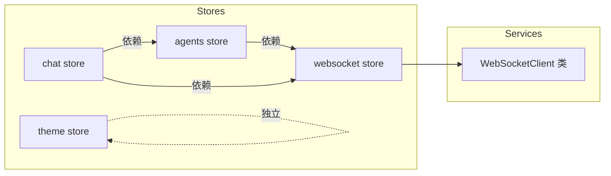

# WebUI 组件架构研究分析（重写前调研）

> 目的：梳理当前 `src/ui/webui` 的组件清单、职责与依赖关系，为前端重写提供基线。
> 调研日期：2026-08-08

---

## 1. 技术栈概况

| 项 | 内容 |
|---|---|
| 框架 | Vue 3.4（Composition API + `<script setup>`） |
| 状态管理 | Pinia 2.1（4 个 store） |
| 构建 | Vite 5 + `vue-tsc` + TypeScript 5.2 |
| Markdown 渲染 | markdown-it + markdown-it-texmath + KaTeX + highlight.js |
| 图表 | chart.js（仅 `TokenUsage.vue` 使用） |
| 其他 | uuid |
| UI 方案 | **无组件库、无路由**，全部手写 scoped CSS + CSS 变量（`dark`/`light` 主题类切换） |
| 路径别名 | `@` → `src/`，`@shared` → `../../shared`（复用后端共享类型） |
| 通信 | WebSocket 为主（`/ws`）+ REST API 为辅（`/api/*`） |

**入口链路**：`index.html` → `src/main.ts`（createApp + Pinia）→ `App.vue`。

---

## 2. 目录结构

```
src/ui/webui/
├── index.html
├── vite.config.ts
├── package.json
└── src/
    ├── main.ts                 # 入口：挂载 Pinia + App
    ├── App.vue                 # 根组件：整体布局编排 + provide/inject 源
    ├── constants.ts            # VIEWER_ID = ref('user')
    ├── env.d.ts
    ├── assets/
    │   ├── base.css            # CSS 变量 / 基础样式
    │   ├── main.css            # 全局样式
    │   └── markdown.css        # markdown 渲染样式
    ├── types/index.ts          # 前端类型（部分 re-export 自 @shared）
    ├── utils/
    │   ├── format.ts           # 时间/大小/相对时间 + insertTimeSeparators（Turn 渲染管线）
    │   ├── logger.ts
    │   └── abap-hljs.ts        # ABAP 语法高亮注册
    ├── services/
    │   └── websocket.ts        # WebSocketClient 类（自动重连 + 积压消息 + 多 handler）
    ├── stores/
    │   ├── websocket.ts        # WS 连接状态 + send/onMessage 转发
    │   ├── agents.ts           # Agent 列表 / 选中 / 排序 / 头像名称查询
    │   ├── chat.ts             # 核心 store（约 1000 行）
    │   └── theme.ts            # 主题切换 + 持久化
    ├── composables/
    │   ├── useMarkdown.ts      # markdown-it 实例 + hljs 主题注入
    │   ├── useToolResult.ts    # 工具结果解析 + 组件分发表
    │   └── useSidePanel.ts     # ⚠️ 孤儿（无引用）
    └── components/
        ├── Sidebar.vue             # 左侧活动栏
        ├── AgentList.vue           # 统一会话列表（Agent + 群组混排）
        ├── GroupList.vue           # ⚠️ 孤儿（被 AgentList 取代）
        ├── WorkspaceTree.vue       # 工作区目录树面板
        ├── WorkspaceTreeNode.vue   # 递归树节点
        ├── ChatView.vue            # 单 Agent 会话窗口
        ├── GroupChat.vue           # 群聊窗口（独立数据管线）
        ├── ChatInput.vue           # 输入框（共享）
        ├── InteractionBar.vue      # ask_questions 决策选项条
        ├── CreateGroupDialog.vue   # 创建群组弹窗
        ├── GlobalSettings.vue      # 全局配置（schema 树形导航）
        ├── AgentSettings.vue       # Agent 配置（LLM/定时器/插件/头像）
        ├── TokenUsage.vue          # Token 用量（chart.js）
        ├── VersionDialog.vue       # 版本更新弹窗
        ├── ChangelogDialog.vue     # 更新日志弹窗
        └── chat/
            ├── FilePreviewModal.vue    # 工作区文件预览弹窗
            ├── ScrollableViewport.vue  # 限高滚动容器
            ├── Message/
            │   ├── Message.vue             # ⚠️ 孤儿（旧消息路由组件）
            │   ├── TurnDisplayItem.vue     # ★ 核心：统一对话轮（turn）渲染
            │   ├── UserMessage.vue
            │   ├── AssistantMessage.vue
            │   ├── ToolMessage.vue
            │   ├── SystemMessage.vue       # ⚠️ 仅被孤儿 Message 引用
            │   └── ThinkingToolGroup.vue   # ⚠️ 孤儿（被 TurnDisplayItem 内联取代）
            └── ToolResult/
                ├── ToolResultCard.vue      # ⚠️ 死 import（被导入未使用）
                ├── ToolResultCode.vue      # read
                ├── ToolResultWeb.vue       # web_search / fetch / browser 系列
                ├── ToolResultTerminal.vue  # bash
                ├── ToolResultWrite.vue     # write
                ├── ToolResultEdit.vue      # edit
                ├── ToolResultSubagent.vue  # subAgent 系列
                ├── ToolResultBrowser.vue   # browser 截图
                └── ToolResultFallback.vue  # ⚠️ 孤儿
```

---

## 3. 组件关系总览

### 3.1 顶层布局（App.vue）



**App.vue 职责（过于集中）**：
- 全部面板可见性状态：`listVisible` / `sidebarVisible` / `globalSettingsVisible` / `tokenUsageVisible` / `versionVisible` / `workspaceTreeVisible` / `previewVisible` / `agentSettingsVisible` / `showCreateGroup` / `activeGroupId`
- 列表宽度拖拽调整（`onResizeStart/Move/End`）
- 群组列表状态与 CRUD（`groups` / `fetchGroups` / `selectGroup` / 群组 WS 事件）
- 通过 **provide** 向下注入：`agentSettingsVisible`、`settingsAgentId`、`editingAgentId`、`sidebarVisible`、`toggleSidebar`、`closeSidebar`

### 3.2 会话窗口（ChatView / GroupChat 双管线）



> **关键发现**：`ChatView` 与 `GroupChat` 是**两套独立的消息渲染管线**，仅在 `TurnDisplayItem` 处汇合：
> - `ChatView`：流式数据走 `chat store`（`_agentMessages` / `_agentTurns` / `_turns` 增量构建），支持历史分页、regenerate、edit、delete、continue。
> - `GroupChat`：本地 `rawMessages` + REST 拉取历史 + 独立 WS `group.message` 监听，功能仅为展示 + 发送，无编辑/重推理。
> - 滚动、时间分隔符、Turn 转换等逻辑**重复实现**（`isNearBottom` / `scrollToBottom` / `insertTimeSeparators` 在两端各写一份）。

### 3.3 消息渲染核心（TurnDisplayItem）



- props：`turn`（`Turn{agent_id, steps[], final}`）、`index`、`settingsAgentId`、`showActions`
- events：`regenerate` / `deleteMessage` / `edit` / `continueGeneration` / `previewFile`
- 内部逻辑：思维链折叠（`chainLabel` 步数/耗时统计）、流式展开管理、左右对齐（`isSelf` vs `settingsAgentId`）

### 3.4 工具结果分发（useToolResult + ToolResult 族）



`COMPONENT_MAP`（`useToolResult.ts`）将工具名 → 展示组件，未知工具返回 `null` 按普通文本渲染。

---

## 4. 状态管理（Pinia Stores）



### 4.1 各 Store 职责

| Store | 状态 | 关键动作 | 备注 |
|---|---|---|---|
| **websocket** | `connected` | `init/send/onMessage/onConnect` | 薄封装，包住 `WebSocketClient`（重连、积压、多 handler） |
| **agents** | `agents[]`、`activeAgentId` | `requestAgents/selectAgent/setAgents/bumpAgent(ById)/getAgentAvatar/getAgentName/tryRestoreLastAgent` | 选择持久化到 localStorage `agentchat.lastAgent` |
| **chat** | `_agentMessages`、`_agentTurns`、`_turns`、`_unreadAgents`、`loadingHistory`、`hasMoreHistory`、`turnInProgress`、`archivePending`、`lastRunEndAt`、`interaction`、`compressPending`、`systemPrompt*`、`toolDefs*`、`copyFeedback` | `sendMessage/regenerateMessage/deleteMessage/editMessage/interruptGeneration/continueGeneration/loadHistory/loadMoreHistory/compressSession/respondInteraction/requestSystemPrompt/requestToolDefs` | **约 1000 行**，是前端最复杂的模块；WS 事件分发 `HANDLERS` 表（见 §5） |
| **theme** | `theme` | `toggleTheme/applyThemeClass` | 持久化 + 派发 `theme-changed` 事件（hljs 主题联动） |

### 4.2 跨组件共享的「非 store」状态

- **provide/inject（App.vue 为源）**：`agentSettingsVisible`、`settingsAgentId`、`editingAgentId`、`sidebarVisible`、`toggleSidebar`、`closeSidebar` —— 字符串 key，无 TS 类型约束。
- **模块级单例**：`VIEWER_ID`（`constants.ts` 的 `ref('user')`，全局 import 共享）。
- **localStorage**：`agentchat.lastAgent`、`agentchat.lastGroup`、`agentchat.unreadAgents`、`agentchat.theme`、`agentchat.simulateUpdate`。

---

## 5. 通信层

### 5.1 WebSocket 消息

**出站（前端 → 后端）**，集中在 chat store / agents store：

| 消息 | 场景 |
|---|---|
| `agent.list` | 拉取 Agent 列表 |
| `chat.send` | 发送消息（含 deepThink / files） |
| `chat.interrupt` | 中断生成 |
| `chat.delete_message` | 删除消息 |
| `history.request` | 加载历史（分页） |
| `chat.interact.respond` | 回复 ask_questions |
| `session.compress` | 归档整理 |
| `chat.continue` | 继续生成 |
| `chat.subscribe` | 订阅会话 |
| `agent.system_prompt` / `agent.tool_defs` | 预览 |
| `system.restart` | 重启后端 |

**入站（后端 → 前端）**，由 chat store 的 `HANDLERS` 表分发（约 30 个事件）：

- `chat.start` / `chat.step.start` / `chat.step.end` / `chat.end` / `chat.interrupted` / `chat.interaction`
- `chat.message.start/update/end/error`、`chat.thinking.start/update/end`、`chat.toolcall.start/update/end`、`chat.tool_execution.start/update/end`
- `chat.session.resume` / `history.response` / `session.compressed` / `session.archived`
- `system.restarting` / `chat.virtual.receive`（虚拟 Agent 推送 → 小红点）
- `agent.system_prompt.response` / `agent.tool_defs.response`
- 群组事件 `group.created/deleted/join/leave/message` → **App.vue** 单独处理

### 5.2 REST API（前端直连）

| 端点 | 使用方 |
|---|---|
| `/api/groups`、`/api/groups/:id`(PATCH/DELETE)、`/api/groups/:id/history` | App / GroupChat / GroupList |
| `/api/agents`(POST/DELETE)、`/api/agents/:id/config`、`/api/agents/:id/timer`、`/api/agents/:id/avatar` | AgentList / AgentSettings / ChatView |
| `/api/config`、`/api/config/pools`、`/api/plugins/schemas`、`/api/plugins/llm-schemas`、`/api/plugins/search-schemas` | GlobalSettings |
| `/api/sessions/:agentId/tokens` | ChatView（Token 占用预测） |
| `/api/usage/tokens` | TokenUsage |
| `/api/version`、`/api/version/changelog` | Sidebar / VersionDialog / ChangelogDialog |
| `/api/backup`(POST) | Sidebar |
| `/api/upload`(POST) | ChatInput |
| `/api/workspace/tree`、`/api/workspace/file`、`/api/workspace/raw` | WorkspaceTree / FilePreviewModal / ToolResultBrowser |
| `/api/browse/file`、`/api/browse/read-file` | GlobalSettings / ToolResultWrite |

> 注意：`api/plugins/:agentId` 在 AgentSettings 使用，`api/browse/read-file` 在 ToolResultWrite 使用（`/api/workspace/*` 与 `/api/browse/*` 两套文件访问接口并存）。

---

## 6. Composables / Utils

| 模块 | 职责 | 使用方 |
|---|---|---|
| `useMarkdown` | markdown-it 单例（texmath/KaTeX/hljs），动态 hljs 主题，返回 `render` / `renderPlain` | AssistantMessage、ToolResultCode/Write、FilePreviewModal、VersionDialog、ChangelogDialog |
| `useToolResult` | `parseToolResult` + `COMPONENT_MAP` 分发 + `useToolResult()` | ToolMessage |
| `useSidePanel` | ⚠️ **孤儿**，无任何引用 | — |
| `utils/format` | 时间/相对时间/大小格式化 + `insertTimeSeparators`（ChatView / GroupChat 共享的渲染管线函数） | ChatView / GroupChat / 各组件 |
| `utils/logger` | 分级日志 | WebSocketClient / useMarkdown / chat store |
| `utils/abap-hljs` | 注册 ABAP 语言 | useMarkdown |

---

## 7. 孤儿代码 / 死代码清单（重写可直接删除）

| 文件 | 状态 | 说明 |
|---|---|---|
| `components/GroupList.vue` | 孤儿 | 旧的独立群组列表，已被 AgentList 的"统一列表"取代 |
| `components/chat/Message/Message.vue` | 孤儿 | 旧的消息路由组件，渲染逻辑已内联进 TurnDisplayItem |
| `components/chat/Message/ThinkingToolGroup.vue` | 孤儿 | 旧的思维链折叠分组，被 TurnDisplayItem 内联实现取代 |
| `components/chat/Message/SystemMessage.vue` | 仅被孤儿引用 | 只被 `Message.vue` import |
| `components/chat/ToolResult/ToolResultFallback.vue` | 孤儿 | 无引用 |
| `composables/useSidePanel.ts` | 孤儿 | 无引用 |
| `ToolResultCard` 的 import | 死 import | `useToolResult.ts` 导入但未在 COMPONENT_MAP 中使用 |

> 这些遗留说明：前端经历过"Message 路由组件 → TurnDisplayItem 统一 turn"和"群组独立列表 → Agent+群组统一列表"两次演进，旧组件未清理。

---

## 8. 架构特征与问题（重写需关注）

### 8.1 架构特征
1. **无路由、无组件库**：所有界面切换靠 `v-if` + provide/inject，样式全手写 scoped CSS + CSS 变量主题。
2. **WS 为中心的事件驱动**：chat store 通过一张 `HANDLERS` 表统一分发后端事件，UI 通过 store 的 ref/computed 响应。
3. **Turn 数据模型**：后端流式事件被增量构建成 `Turn{steps[], final}` 结构，前端按对话轮（turn）渲染，配合时间分隔符与 trigger 分隔符平铺。
4. **消息缓冲 per-agent**：`_agentMessages[agentId]` 字典隔离不同 Agent 的对话，切换不丢流式状态。
5. **工具结果高度组件化**：`useToolResult` 分发表让每种工具结果有独立展示组件，扩展工具只需加映射。

### 8.2 主要问题
| # | 问题 | 影响 |
|---|---|---|
| 1 | **App.vue 过度膨胀**：布局 + 群组 CRUD + 面板可见性 + resize 拖拽全在一个组件 | 职责不清，重写时应拆为 composable / store / 布局组件 |
| 2 | **ChatView / GroupChat 双管线**：两套消息渲染、滚动、历史逻辑重复 | 群聊功能弱（无编辑/重推理/流式细节），维护成本翻倍 |
| 3 | **chat store 过大**（~1000 行）：状态 + 流式 + 事件分发 + 分页 + 交互 + 预览 | 可拆分为多个关注点（stream、history、interaction、preview） |
| 4 | **provide/inject 用字符串 key** | 无类型安全，改名易漏 |
| 5 | **FilePreviewModal 三处实例化**（App / ChatView / GroupChat） | 应提升为全局单例（如通过 pinia 或 teleport 统一管理） |
| 6 | **群组状态在 App.vue 本地**而非 store | 与 Agent 状态管理方式不一致 |
| 7 | **REST 与 WS 混用、`/api/workspace/*` 与 `/api/browse/*` 并存** | 前端 API 层未统一封装，重写时建议建 `api/` 服务层 |
| 8 | **类型依赖 `@shared` 别名** | 重写需保留该路径映射 |
| 9 | **手写 CSS 无设计系统** | 样式散落各组件，主题全靠 CSS 变量约定，重写可考虑引入设计令牌体系 |

---

## 9. 重写建议（方向性）

1. **引入路由**（vue-router）或明确的分层状态机，替代 `v-if` 硬切换；单 Agent 会话与群聊走同一套消息渲染管线。
2. **消息渲染管线收敛**：将 `TurnDisplayItem` + 时间分隔符 + 滚动管理提炼为可复用组件/composable，ChatView 与 GroupChat 共用。
3. **状态分层**：`chat` store 拆分为 `session`（消息缓冲）/ `stream`（流式状态机）/ `history` / `interaction` 等；群组状态入 store。
4. **统一 API 服务层**：封装 `api/`（REST）+ `ws/`（事件总线），组件不直接 `fetch`/`ws.send`。
5. **provide/inject 用 InjectionKey 或 Composition 封装**，替换字符串 key。
6. **文件预览提升为全局单例**。
7. **删除 §7 的孤儿代码**，保持基线干净。
8. **保留**：`useMarkdown`、`useToolResult` + ToolResult 组件族、`ScrollableViewport`、`WebSocketClient`、`@shared` 类型复用、CSS 变量主题思路。
