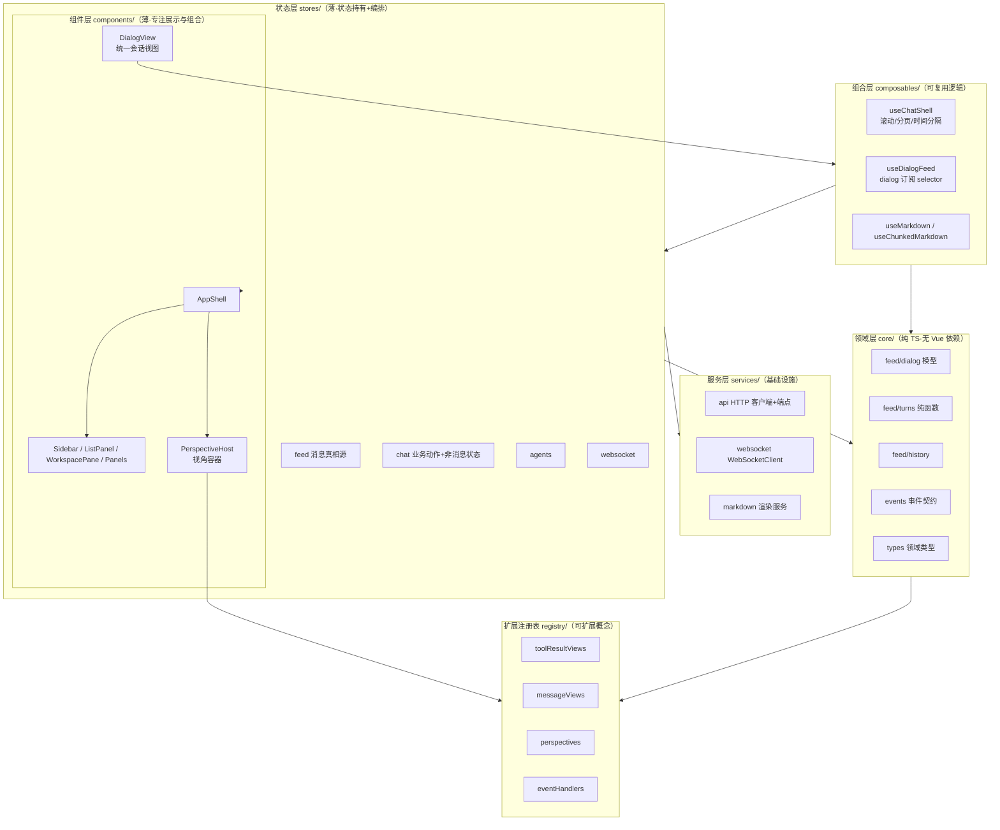

# WebUI 重构方案（webui-preview 平行版本策略）

> 状态：**已完成 · 2026-08-13 验收通过并替换正式版** · 日期：2026-08-12
> 目标：① 架构优雅清晰 ② 引入可扩展概念
> 策略：**新建 `src/ui/webui-preview` 独立版本（端口 3832）作为重构目标，验收"效果差不多"后替换正式 `src/ui/webui`（3831）**；正式版在重构期间保持可用、可随时回切。
> 约束：后端契约（WS 事件 / REST 端点）冻结；`@shared` 类型复用不变；preview 经 Vite proxy 复用同一后端（3830），**后端零改动**。

---

## 0. 执行进度（2026-08-12）

| 阶段 | 内容 | 状态 |
|---|---|---|
| 0 | 建立 preview 基底（3832 / 包名 / 标题 / tag webui-v1-freeze） | ✅ |
| 1 | 清理死代码（8 组件 + 1 composable + 死分支） | ✅ |
| 2 | 事件契约 contract.ts + 统一 API 层（29 处裸 fetch → core/api） | ✅ |
| 3 | useChatShell + DialogView 合并 ChatView/GroupChat（双管线消除） | ✅ |
| 4 | 布局 Shell（ui store + groups store + ResizeHandle + AppShell） | ✅ |
| 5 | 扩展点：toolResultViews / messageViews / perspectives+PerspectiveHost / eventHandlers | ✅ |
| 6 | tokens.css 业务兼容别名层（单一基准）+ DialogView 抽屉拆分 GroupDrawer | ✅（大文件继续拆分列为遗留） |
| 7 | 类型收口：ChatMessage.role + 'user'、消除 as 断言、删测试兼容 re-export | ✅（data:any 全面类型化列为遗留） |
| 8 | 验收（3832 vs 3831 功能等价矩阵 + 视觉走查） | ✅ 2026-08-13 完成 |

**替换执行记录（2026-08-13）**：
- `webui` → `webui_v1_archive`（归档，可回滚）；`webui-preview` → `webui`
- 恢复正式版配置：端口 3831、标题 AgentChat、包名 agentchat-webui
- 根 tsconfig exclude 增加 `src/ui/webui_v1_archive`；根 package.json 删除 `dev:frontend:preview`
- 构建新 dist 成功；后端 3830 直接 serve 新 dist 验证通过
- 新 webui dev（3831）运行正常：Token 弦图（d3-chord）/默认排除 user-self/横躺竖排标签/防闪烁全部生效

**遗留项（不影响替换，可在替换后继续）**：
- 大文件拆分：AssistantMessage(671) / AgentPane(687) / TokenUsage(619) / SettingsPanel(589) / feed.ts
- `data: any` 全面类型化（依赖后端载荷结构逐事件定义）
- main.css 重复变量删除（别名层已建立基准，删除需回归视觉）

**preview 期间验证记录**：vue-tsc 全绿；direct 会话（消息/工具卡/Token 仪表盘）、群组（成员消息/抽屉）、空态、PerspectiveHost 链路均实测正常。

---

## 1. 现状诊断（依据源码逐文件核对，非旧文档）

### 1.1 做得好的（重构保留）

| 模块 | 优点 |
|---|---|
| `stores/feed.ts` + `utils/feed.ts` | 消息数据已统一为 per-dialog `rawMessages` 单一真相源；`buildTurnsIncremental` 增量 memo 解决流式全量重渲染 |
| `settings/` | `api.ts` / `schema.ts` / `useSettings.ts` 分层清晰，是全项目最干净的子模块 |
| `services/websocket.ts` | `WebSocketClient` 基础设施（重连/积压/多 handler）职责单一 |
| `composables/useChunkedMarkdown.ts` | 流式分块渲染解决 O(n²)，逻辑内聚 |
| `chat/Message/` 系列 | `TurnDisplayItem` 已作为统一渲染入口，叶子组件（User/Assistant/Tool）职责基本清晰 |

### 1.2 主要问题（按严重程度）

| 级别 | 问题 | 证据 |
|---|---|---|
| 🔴 P0 | **死代码 8 组件 + 1 composable + 1 无用 import** | `GroupList.vue`(367 行)、`Message.vue`、`SystemMessage.vue`、`ThinkingToolGroup.vue`、`ToolResultFallback.vue`、`SidePanelSearch.vue`、`ChangelogDialog.vue`、`useSidePanel.ts`；`useToolResult.ts` L9 未消费的 `ToolResultCard` import |
| 🔴 P0 | **双渲染外壳大量重复**（`ChatView.vue` 1218 行 vs `GroupChat.vue` 509 行） | 滚动（ChatView L198-241 vs GroupChat L137-150）、历史分页（ChatView L244-396 ≈60 行 vs GroupChat L180-194）、时间分隔、FilePreviewModal 状态、回到底部、删除确认全部重复；且 ChatView 走 `chat` store、GroupChat 直连 `feed` store，消费入口不一致 |
| 🔴 P0 | **HTTP 无统一 API 层** | 29 处裸 `fetch` 散落 19 个文件；错误处理风格不一（静默 catch / `resp.ok` / throw） |
| 🟠 P1 | **双设计令牌体系并存** | `ui/tokens.css`（`--bg-*/--primary/--text-1`）仅 UI 库自用；业务实际用 `assets/main.css`（`--color-*/--space-*/--layout-*`）；组件大量硬编码回退色值 `var(--color-primary, #6366f1)` |
| 🟠 P1 | **大文件** | ChatView 1218、feed.ts 803、AgentPane 687、AssistantMessage 671、TokenUsage 619、SettingsPanel 589、FilePreviewModal 560、GroupChat 509 |
| 🟠 P1 | **App.vue 上帝组件**（366 行） | 混合布局/群组状态/两套几乎相同的拖拽 resize/移动端/provide/WS 事件 |
| 🟡 P2 | **feed/chat 双 store 过渡残留** | chat.ts L22 re-export util 仅因旧测试；`turnInProgress` 等物理归属 feed 但由 chat 暴露；GroupChat 绕过 chat 直连 feed |
| 🟡 P2 | **WS 事件字符串 / provide key 散落** | 30+ 事件字符串散落 feed.ts L483-610、chat.ts L333-366 及各组件；provide key 为裸字符串 |
| 🟡 P2 | **`any` 滥用** | feed.ts 全部事件 `data: any`；chat.ts `HANDLERS`、`toolDefs: any[]`；settings 全线 `Record<string, any>` |
| 🟢 P3 | **其他残留** | ChatView L359 `console.log` 调试；GroupChat 死分支（trigger 分隔符）、空函数 `leaveGroup()`；FilePreviewModal 三实例；`ChatMessage.role` 无 `'user'` 历史包袱 |

---

## 2. 目标架构

### 2.1 分层总览



### 2.2 分层原则（本次重构的"优雅"定义）

1. **单向数据流**：WS/REST 事件 → `core` 归一化 → `store` 更新 → `computed` 派生 → 组件渲染。组件**只读 store，不直接发消息逻辑**。
2. **依赖方向向内**：`components → composables → stores → services/core`；禁止反向与跨层（组件不得直接 `fetch`、不得直接 `ws.send`）。
3. **core 无 Vue 依赖**：领域纯函数与类型放 `core/`，可直接被根目录 vitest 测试（复用现有 `tests/webui-*.test.ts` 模式）。
4. **一个职责一个文件**：>400 行的文件必须拆分；拆分粒度按"职责"，不按"美观"。
5. **统一消费入口**：视图层统一从 `feed`（数据）与 `chat`（动作）读取，删除"ChatView 走 chat / GroupChat 走 feed"的不一致。

### 2.3 目录目标形态

```
src/
├─ main.ts                    入口：装配（注册表初始化、全局 provider）
├─ app/                       应用装配层
│   ├─ bootstrap.ts           启动顺序编排（stores → registry → ws）
│   └─ registry/              扩展注册表（见 §3）
├─ core/                      领域纯逻辑（无 Vue 依赖，可单测）
│   ├─ feed/                  dialog.ts / turns.ts / history.ts / activity.ts / ingest.ts
│   ├─ events/                contract.ts（WS 事件常量+载荷类型）/ types.ts
│   └─ api/                   client.ts（request<T>() 提升全局）+ endpoints/（按资源分文件）
├─ services/                  基础设施
│   ├─ websocket.ts           WebSocketClient（保留）
│   └─ markdown.ts            markdown-it 单例（从 useMarkdown 抽出纯服务）
├─ stores/                    Pinia 状态层（薄）
│   ├─ feed.ts / chat.ts / agents.ts / websocket.ts / theme.ts / ui.ts(新)
├─ composables/               组合逻辑
│   ├─ useChatShell.ts(新)    会话外壳：滚动/分页/时间分隔/回到底部/FilePreview
│   ├─ useDialogFeed.ts(新)   dialog 订阅（含 turns 增量）
│   ├─ useMarkdown.ts / useChunkedMarkdown.ts / useToolResult.ts（保留演进）
├─ components/
│   ├─ layout/                AppShell / Sidebar / ListPanel / ResizeHandle(新) / Panels
│   ├─ dialog/                DialogView(新·合并 ChatView+GroupChat) / ChatInput / InteractionBar
│   ├─ chat/                  Message/* / ToolResult/*（按注册表）
│   └─ panels/                WorkspaceTree / FilePreviewModal / TokenUsage / VersionDialog
├─ ui/                        基础组件库（统一令牌）
├─ settings/                  保持现状，仅去耦合（内联定时任务 CRUD 抽出）
└─ types/                     re-export core 类型（兼容旧导入）
```

---

## 3. 可扩展概念（本次重构的核心增值）

> 设计哲学：**"扩展点即注册表"**。系统行为由注册表驱动，新增能力 = 注册一项，而非改 switch/if。

### 3.1 事件契约与处理器注册表（EventHandlers）

- **现状**：`feed.ts` 的 `ingest()` 是一个约 130 行的大 switch（`chat.start/step.*/toolcall.*/history.response/group.message/...`）。
- **目标**：`core/events/contract.ts` 定义**全部 WS 事件常量与载荷类型**（单一来源，消灭散落字符串）；`feed` 内部改为 `EventHandlerRegistry`：`register(event, handler)`，`ingest` 只做查表分发。
- **收益**：事件名改一处生效；新事件 = 注册 handler；载荷全部类型化（消灭 `data: any`）。

### 3.2 消息视图注册表（MessageViews）

- **现状**：`TurnDisplayItem.vue` 用 if/else 按 role 分发 User/Assistant/Tool。
- **目标**：`registry/messageViews.ts`：`register(role|kind, { component, match })`，按 `priority` 匹配，带 fallback。`TurnDisplayItem` 只做查表。
- **收益**：新增消息形态（trigger 卡、error 卡、未来的 system 卡）不触碰渲染入口；扩展点类型化。

### 3.3 工具结果视图注册表（ToolResultViews）★ 最成熟的切入点

- **现状**：`useToolResult.ts` 的 `COMPONENT_MAP` 是硬编码 `Record<string, Component>`（约 25 个映射），无法动态扩展、无覆盖优先级、fallback 靠调用方。
- **目标**：升级为 `registry/toolResultViews.ts`：
  - `registerToolResultView(toolName | RegExp, component, { priority })`
  - 匹配链：精确名 → 正则族 → 默认文本 fallback
  - 现有映射迁移为**内置注册**（行为不变），未来可被插件覆盖/追加。
- **收益**：这是"新增工具渲染卡"的标准扩展点；后端新增工具时前端只需注册一个组件。

### 3.4 视角系统（Perspectives）—— 顶层扩展点 ★

- **依据**：`docs/feed-architecture.md` 的"统一信息流 + 视图即筛选"方向；v2 实验里验证过的"perspectives/messageViews/toolResultViews 插槽注册表"思路。
- **目标**：`registry/perspectives.ts` 定义视角注册表：

  ```ts
  interface Perspective {
    id: string;
    label: string;
    icon: string;
    /** 从统一 feed 派生该视角的渲染模型 */
    select: (feed: FeedStore) => ComputedRef<DisplayItem[]>;
    component: Component;
  }
  ```

  - 会话（direct）、群组（group）、工作区（files）是**三个已注册视角**；它们共享同一 `feed` 数据源，只是 `select` 不同。
  - `AppShell` 内放 `PerspectiveHost`：切换视角 = 切换注册项，`v-if` 大杂烩与双管线自然消失。
- **收益**：未来"社区流 / 星图 / 过程工作台"（设计方向文档中的多视角）只需新增注册项，不改主框架。`DialogView` 成为可复用的会话渲染内核，被 Talk/Work/Community 视角复用。

### 3.5 布局 Shell 与面板插槽（Layout + Panels）

- **现状**：`App.vue` 用一个 ref 管理 7 个面板可见性，两套拖拽 resize 复制粘贴。
- **目标**：
  - `stores/ui.ts`：布局状态（面板可见性、宽度、移动端）统一托管。
  - `components/layout/ResizeHandle.vue`：一套可复用拖拽（左右/反向方向参数化），消除复制。
  - `AppShell` 只做骨架编排；各面板（列表/工作区/预览/设置/Token 用量）以**插槽或注册项**挂载。
- **收益**：新面板 = 注册一个 + 挂一个插槽；移动端逻辑收敛一处。

### 3.6 设计令牌单一源（Design Tokens）

- **现状**：`ui/tokens.css` 与 `assets/main.css` 两套变量并存，业务硬编码回退值。
- **目标**：以 `ui/tokens.css` 为**唯一令牌源**（几何/字体/动效/双主题色板），`main.css` 仅保留全局 reset 与少量业务语义类；组件内禁硬编码色值（grep 校验）。
- **收益**：主题扩展（未来第三套主题 / 用户自定义色）只改令牌文件；`--color-primary` 等旧变量通过映射层过渡。

---

## 4. 分阶段实施计划（在 webui-preview 上执行）

> 原则：preview 与正式版**互不干扰**；每阶段在 3832 上独立验证；正式版 3831 始终可回切。
> 验收基线：preview `vue-tsc --noEmit` 零错 + 纯函数用例全绿 + 3832 手测（对照 3831）。

### 阶段 0 · 建立 preview 基底（0.5 天）
- 拷贝 `src/ui/webui` → `src/ui/webui-preview`；调整 package.json/tsconfig/vite 配置：dev 端口 **3832**，proxy 同 3830，`@` 别名指向 preview/src。
- 新增根脚本 `dev:frontend:preview`（`cd src/ui/webui-preview && npm run dev`）；preview **不接入** `scripts/build-release.ts`（替换前不参与正式构建）。
- 冻结正式版：`src/ui/webui` 进入"仅修 P0"状态；打 tag `webui-v1-freeze`。
- 产出：3831 与 3832 双版本可同时运行、行为一致。

### 阶段 1 · 清理死代码（0.5 天）
- 在 preview 中删除：`GroupList.vue`、`Message.vue`、`SystemMessage.vue`、`ThinkingToolGroup.vue`、`ToolResultFallback.vue`、`SidePanelSearch.vue`、`ChangelogDialog.vue`、`useSidePanel.ts`；`useToolResult.ts` 的 `ToolResultCard` import；死 provide `'sidebarVisible'`；`DisplayItem.type:'message'` 死分支。
- 验收：preview `vue-tsc` 零错；grep 无残留 import；3832 手测功能无回归。

### 阶段 2 · 基础设施层（1.5 天）
- 建 `core/events/contract.ts`：收敛全部 WS 事件常量+载荷类型（从 feed.ts/chat.ts/组件提取）。
- 建 `core/api/`：把 `settings/api.ts` 的 `request<T>()` 提升为全局 `core/api/client.ts`；按资源建 `endpoints/`（groups/sessions/workspace/usage/upload/backup/config/agents/...）；**替换 29 处裸 fetch**（错误处理统一为"抛 Error + 可选静默"）。
- **同步更新根 vitest 中直接 import webui utils 的旧用例路径**（preview 不再需要兼容 re-export 层）。
- 验收：preview 无裸 `fetch(`（api 层除外）；WS 事件字符串全部来自 contract。

### 阶段 3 · 统一会话视图外壳（2 天）★ 关键重构
- 新建 `composables/useChatShell.ts`：合并滚动（流式双 rAF）、历史分页、时间分隔、回到底部、FilePreview 状态。
- 新建 `composables/useDialogFeed.ts`：统一 dialog 订阅（direct/group 都从 feed 取数+动作），消除"ChatView 走 chat / GroupChat 走 feed"分歧。
- 合并 `ChatView.vue` + `GroupChat.vue` → `components/dialog/DialogView.vue`（内核统一，群组差异少量分支）。
- 验收：direct 与群组行为逐项对比无回归（对照 3831 正式版）。

### 阶段 4 · 布局 Shell 化（1 天）
- `stores/ui.ts` 托管面板状态；`ResizeHandle.vue` 参数化方向；`AppShell` 重排 App.vue 骨架；群组状态与 `fetchGroups` 移入 `stores/groups.ts`。
- 验收：移动端抽屉/拖拽/各面板开关手测通过；preview App.vue ≤ 100 行。

### 阶段 5 · 扩展点落地（2 天）★ 可扩展概念
- `registry/toolResultViews.ts`（迁移 COMPONENT_MAP，加优先级+正则+fallback）。
- `registry/messageViews.ts`（TurnDisplayItem 改查表）。
- `registry/perspectives.ts` + `PerspectiveHost`：注册 talk(direct)/group/files 三个视角。
- `registry/eventHandlers.ts`：ingest 大 switch 改注册表分发。
- 验收：功能等价（对照 3831）；"玩具注册项→移除"验证扩展路径通畅。

### 阶段 6 · 令牌统一 + 大文件拆分（2 天）
- 双令牌体系合并（§3.6）；grep 校验组件无硬编码色值。
- 拆分大文件：`AssistantMessage.vue`(671) → 子组件；`TokenUsage.vue`(619) → charts/tables 子件；`SettingsPanel` 内联定时任务 CRUD → `useSettings` 或独立 composable；`AgentPane`(687) 按分区拆子组件；`feed.ts`(803) 的 ingest 已在阶段 5 拆分，剩余按 core/ 迁移。
- 验收：preview `vue-tsc` 零错；最大文件 ≤ 400 行（除少量合理例外）。

### 阶段 7 · 类型收口（1 天）
- `ChatMessage.role` 增加 `'user'`（或引入 `Role` 判别联合），消除 `(msg.role as string)==='user'` 断言。
- 消灭 `data: any`（依赖阶段 2 的载荷类型）；`toolDefs` 类型化。
- 验收：preview 无 `any` 残留（settings 例外项按白名单）。

### 阶段 8 · 验收与替换（1 天）★ 策略闭环
- 逐项跑"功能等价矩阵"（3832 vs 3831，见 §7）；视觉走查；流式性能对比。
- 替换动作（**路径零改动**，构建脚本/后端/desktop 均不受影响）：
  1. `git tag webui-preview-accept`
  2. 停 3831 与 3832
  3. `git mv src/ui/webui src/ui/webui_v1_archive`（或直接删除）
  4. `git mv src/ui/webui-preview src/ui/webui`
  5. 完整构建新 `src/ui/webui/dist`，重启后端验证 3830 直接 serve 正常 → `npm run dev:frontend` 即为新版本
- 回滚预案：`git checkout webui-v1-freeze` 即回正式版。
- **时间盒：preview 生命周期 ≤ 2 周**，到点未达验收标准则废弃 preview、回原地重构路线（避免双代码库长期 drift）。

---

## 5. 需要评审的决策点

### A. 策略级决策（preview 模式引入的新决策，优先级最高）

| # | 决策 | 建议 | 理由 |
|---|---|---|---|
| A1 | preview 的**基底来源**：拷贝现有 webui 改造，还是白纸重写？ | **拷贝改造**（推荐） | feed 架构/增量 turns/流式分块 markdown/移动端技巧/群组历史 REST 都是踩坑验证的成果；白纸重写将全部丢失、重构期失控。拷贝后删死代码+重排=受控重写 |
| A2 | preview 的**形态**：独立目录 vs git 分支 vs 原地+tag？ | **独立目录 `src/ui/webui-preview`**（端口 3832，Vite proxy 到 3830） | 可同时跑 3831/3832 对比、后端零改动、替换时 `git mv` 干净；沿用 webui-v2 先例。必须给 preview 明确生命周期（阶段 8 时间盒） |
| A3 | 并行期**功能策略**：正式版冻结 vs 两边同步？ | **正式版冻结新功能**（仅修 P0），preview 是唯一演进点 | 否则双份改造成本翻倍、preview 永远追不上正式版 |
| A4 | **替换机制**（验收通过后） | 目录重命名：`git mv src/ui/webui src/ui/webui_v1_archive` → `git mv src/ui/webui-preview src/ui/webui` | 后端默认 staticDir（`../ui/webui/dist`）、`scripts/build-release.ts`、根 `dev:frontend`/`build:frontend` 全部指向 `src/ui/webui`，重命名后零改动；desktop 指向 3830 后端，不受影响 |
| A5 | **后端契约**在 preview 期间 | **完全冻结**（3830 不因 preview 改动）；发现契约问题记 issue，替换后再处理 | preview 经 proxy 复用 3830，契约变动会同时影响正式版，违背"互不干扰" |

### B. 架构级决策（原 D1-D6 在 preview 语境下的重估）

| # | 决策 | 建议 | 理由 |
|---|---|---|---|
| B1 | 是否引入 Vue Router？ | **不引入**，用视角注册表 + `stores/ui.ts` | 当前无深链接需求；视角系统可覆盖多视角；preview 虽可零成本试错，但 Router 对 3 视图收益仍低 |
| B2 | `feed`/`chat` 双 store？ | **保留分离理念，但彻底收敛**：删除转发 computed、删除兼容 re-export（preview 不受旧测试导入路径约束）；视图统一经 `useDialogFeed` | 数据(feed)/动作(chat)边界合理；preview 无兼容包袱，可一步到位 |
| B3 | 设计令牌基准 | preview **直接以 `ui/tokens.css` 为唯一基准**（无过渡期）；**沿用中性扁平化设计语言**（确认） | preview 无迁移包袱；用户此前已明确"标准通用中性的扁平设计" |
| B4 | UI 库范围（未用组件 ScrollView/StatusDot/Tooltip/StarCard/PulseTrace） | preview **只拷贝有实际消费的组件**（Modal/Icon/Button/Avatar）；未用组件不拷贝，按需再建 | 保持"有需求才存在" |
| B5 | 群组与 direct 统一渲染内核？ | **是**，`DialogView` 内核统一 | 消灭双管线是本次最大收益；preview 无"行为等价"强约束，只需"功能等价" |
| B6 | 视角系统立即引入？ | **轻量引入**：3 个视角注册 + PerspectiveHost，防过度设计 | 可扩展概念的核心交付；但当前只有 3 视图，注册表保持最小接口 |

### C. 待确认小项
- preview 命名/端口：`webui-preview` / 3832（可改）
- preview 测试放置：纯函数测试放 preview 内（复用根 vitest 或独立），不依赖旧用例路径
- 视觉走查方式：人工切端口对比，或需要并排对比页（可选）

---

## 6. 风险与注意事项

### preview 模式特有
1. **双代码库 drift**：preview 长期不替换 → 两版分叉。缓解：阶段 8 时间盒（≤2 周）+ 正式版冻结降 drift。
2. **替换瞬间的集成风险**：目录重命名涉及构建产物（dist）与后端静态服务；替换前必须完整构建新 `webui/dist` 并验证 3830 直接 serve 正常。
3. **功能冻结的体验损失**：正式版仅修 P0 期间用户无新功能；需认可该窗口期。
4. **拷贝后的基线漂移**：preview 是拷贝时刻的快照，若正式版期间有 P0 修复，需小步 backport 到 preview。

### 重构固有风险（沿用）
5. **滚动行为差异**：ChatView 双 rAF vs GroupChat 单行赋值，统一 `useChatShell` 以 ChatView 流式优化为基准，流式场景重点手测。
6. **增量 turns 失效路径**：`invalidateTurns()` 触发点（remove/replace/truncate/merge/群组历史）在阶段 3/5 移动代码时不可遗漏。
7. **群组历史走 REST**（feed.loadGroupHistory）、direct 历史走 WS——统一 `useDialogFeed` 时内部化该差异。
8. **FilePreviewModal 三实例**：合并为全局单例（AppShell 挂载一次，事件驱动打开），注意滚动位置/文件切换既有行为。
9. **移动端**：布局改动时抽屉/遮罩/点击穿透（pointer-events 技巧）回归手测。
10. **后端契约冻结**：本方案不改任何后端契约；发现问题记 issue，不混入本次。

---

## 7. 验收总标准（3832 vs 3831 对比）

### 功能等价矩阵（逐项在 3832 验收、对照 3831）
- **P0**：direct 会话收发/流式渲染/停止/重生成/删除/编辑 · 群组创建/成员/消息/历史 · 历史分页加载 · 文件预览/下载
- **P1**：设置面板（Agent/池/扩展工具/定时器/命名空间）· Token 用量 · 版本信息 · 工作区树 · 移动端抽屉 · 主题切换
- **P2**：复制反馈/压缩/busy 提示/ask_questions 交互 · system prompt / tool defs 预览

### 质量门禁（preview）
- `vue-tsc --noEmit` 零错误；纯函数用例（根 vitest 或 preview 内）全绿。
- grep 校验：无裸 `fetch(`（api 层除外）、无 `data: any`、无散落 WS 事件字符串（除 contract）、无硬编码色值（除 tokens）。
- 最大业务组件文件 ≤ 400 行。
- 扩展点（toolResultViews/messageViews/perspectives/eventHandlers）各有"玩具注册→移除"验证记录。
- 视觉走查：3832 与 3831 双开，主要界面逐屏对比（扁平化设计语言一致）。
- 性能对比：长会话流式渲染不卡顿（增量 turns + 分块 markdown 生效）。
