# Agent 核心架构文档

## 概览

```
src/core/
├── types.ts      # 所有类型定义
├── config.ts     # 全局运行时配置
└── agent.ts      # ReAct 引擎（单文件 ~400 行）
```

## agent.ts 结构

文件按功能分 4 个区域：

```
agent.ts
├── 公开类型          AgentResult, LLMProvider
├── 内部工具          StreamState, toolLabel, thinkingLabel, 9 个 emit* 函数
├── Agent 类
│   ├── 配置          setLLM, registerTool, usePreHook...
│   ├── ReAct 循环    run → executeLoop → handleResponse
│   ├── LLM 调用      invokeLLM
│   ├── 工具执行      executeToolCalls
│   ├── 辅助          pushAssistant, pushPartial, finalLLMCall
│   └── 电话模式      receive
└── (End)
```

## 公开 API

| 导出 | 类型 | 用途 |
|------|------|------|
| `Agent` | class | 核心引擎，外部唯一入口 |
| `AgentResult` | interface | `run()` / `receive()` 返回类型 |
| `LLMProvider` | interface | LLM 适配器接口 |

### Agent 公开方法

| 方法 | 用途 |
|------|------|
| `setLLM(llm)` | 注入 LLM 适配器 |
| `registerTool(t)` | 注册单个工具 |
| `registerTools(ts)` | 批量注册工具 |
| `usePreHook(h)` | 添加前置钩子（注入记忆、压缩上下文） |
| `usePostHook(h)` | 添加后置钩子（持久化、日志） |
| `setMaxIterations(n)` | 设置最大迭代次数 |
| `run(ctx, emitter?, opts?, signal?)` | 执行完整 ReAct 推理循环 |
| `receive(msg, emitter?, signal?)` | 电话模式入口，包装 `run()` |

## ReAct 循环流程

```mermaid
flowchart TD
    A[run] --> B[pre-hooks]
    B --> C[executeLoop]
    C --> D{中断?}
    D -->|是| M[post-hooks]
    M --> E["返回 &#123;interrupted:true&#125;"]
    D -->|否| F[invokeLLM]
    F --> G{响应类型?}
    G -->|stop / 无工具| H[最终回复]
    G -->|tool_calls| I{最后一轮?}
    I -->|是| J["软结束: 阻止工具 + finalLLMCall"]
    I -->|否| K[executeToolCalls]
    K --> L{中断?}
    L -->|是| M
    L -->|否| C
    H --> M
    J --> M
    M --> N[返回]
```



所有退出路径（中断、正常完成、软结束、maxIterations 耗尽、异常）都经过唯一的 `post-hooks` 节点。

## Agent 私有方法

| 方法 | 调用次数 | 职责 |
|------|---------|------|
| `executeLoop` | 1（run） | ReAct 循环体：中断检查 → invokeLLM → handleResponse |
| `handleResponse` | 1（executeLoop） | 响应分派：最终回复 / 工具调用 / 软结束 / 中断 |
| `invokeLLM` | 2（executeLoop + finalLLMCall） | LLM 调用：流式/非流式 + 异常兜底 |
| `executeToolCalls` | 2（handleResponse 正常路径 + 软结束路径） | 工具执行：正常执行 / blocked（通过 `blockMsg` 区分） |
| `finalLLMCall` | 1（handleResponse 软结束分支） | 最终无工具 LLM 调用 |
| `pushAssistant` | 2（handleResponse） | 构造 assistant 消息并入队 |
| `pushPartial` | 1（handleResponse 中断分支） | 中断时保存部分流式输出 |
| `applyPreHooks` | 1（run） | 链式执行前置钩子 |
| `applyPostHooks` | 1（run） | 执行后置钩子（副作用） |

## 事件系统（9 个 emit* 函数）

所有事件函数为局部函数，`emitter?.({...})` 的薄包装，统一构造 `StreamEvent`。

| 函数 | type | 调用方 |
|------|------|--------|
| `emitInterrupted` | `chat.interrupted` | executeLoop, handleResponse, executeToolCalls |
| `emitResponseStart` | `chat.response.start` | invokeLLM, finalLLMCall |
| `emitChunk` | `chat.response.chunk` | invokeLLM, finalLLMCall |
| `emitResponseDone` | `chat.response.done` | handleResponse, finalLLMCall |
| `emitThinkingStart` | `chat.thinking.start` | invokeLLM |
| `emitThinkingChunk` | `chat.thinking.chunk` | invokeLLM |
| `emitThinkingDone` | `chat.thinking.done` | invokeLLM |
| `emitToolStart` | `chat.tool.start` | executeToolCalls |
| `emitToolDone` | `chat.tool.done` | executeToolCalls |

## executeToolCalls 的双路径

一条方法覆盖两种场景，通过 `blockMsg` 参数区分：

| `blockMsg` | 行为 |
|-----------|------|
| `null` | 正常执行 `tool.execute(args)` |
| 非空字符串 | 注入 `{ status: 'blocked', ... }` |

两种路径共享相同的事件发射（`tool.start` → `tool.done`）和消息入队。

## 关键设计决策

1. **单文件**：所有核心逻辑在 `agent.ts` 中。LLM 调用、工具执行、事件发射不是独立模块——它们只有一个使用者（Agent），拆出去只增加跳转成本。
2. **post-hooks 唯一出口**：`run()` 中 post-hooks 只调用一次，保证中断/异常路径也会持久化 `loopMessages`。
3. **结构化返回值**：`AgentResult { content, interrupted }` 替代魔法字符串，消费方（Router）直接读 `interrupted` 字段。
4. **pre-hooks 链式 vs post-hooks 副作用**：pre-hooks 是变换链（每步修改 context 传递给下一步），post-hooks 是副作用（持久化、日志），各自遵循不同的类型约束。
