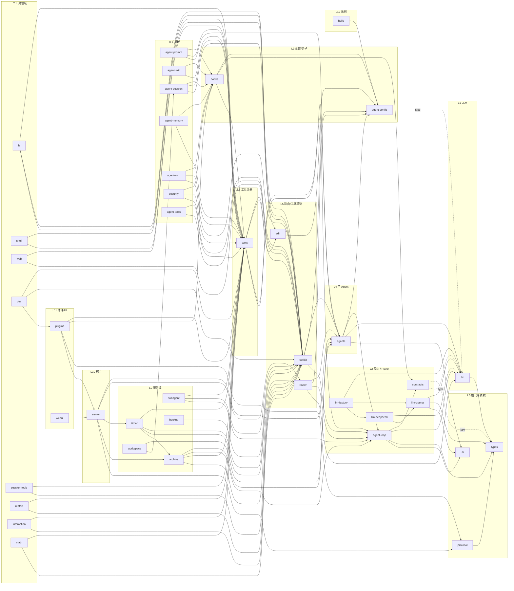
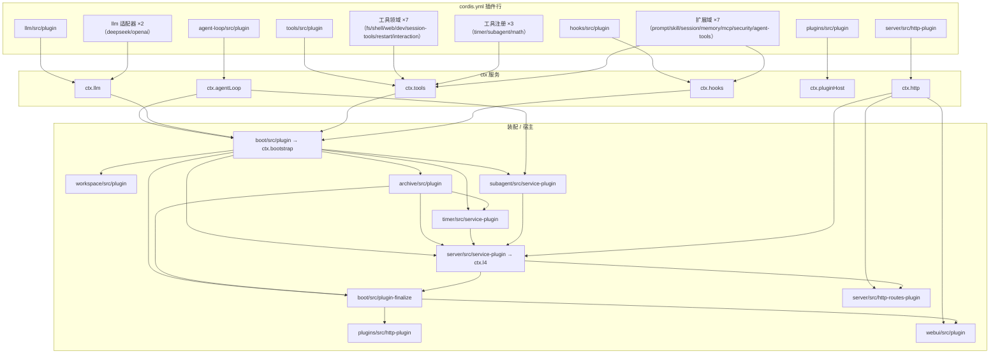

# AgentChat 依赖图与依赖规则

> 版本：v0.6.3（2026-08-16） · 由 `scripts/gen-deps-graph.mjs` 自动扫描生成。
> 交互式版本：[dependency-graph.html](dependency-graph.html)（浏览器打开；含边类型开关、搜索、缩放）。
> 重新生成：`node scripts/gen-deps-graph.mjs`

---

## 1. 数据口径

- **图 1（包依赖图）**：扫描 `src/*/*/package.json` 的 `@agentchat/*` 依赖 + 各包 `src/`、`tests/` 的 import 语句分类。
- **排除**：`@agentchat/boot`（装配聚合根，扇出到几乎所有包，单独见图 2）与 `src/vendor/*`（本地 cordis 生态，见 [vendor-ecosystem.md](plugins/vendor-ecosystem.md)）。
- **边类型**：

| 类型 | 含义 | 线型 |
|------|------|------|
| 值边 | src 值导入（运行期耦合） | 实线 |
| 类型边 | src 仅 `import type`（契约耦合，允许反向） | 虚线 |
| 仅测试 | 只有 tests 引用 | 点线 |
| 未使用 | package.json 声明但无 import | 淡线 |

- 当前统计（自动生成）：**40 包（不含 boot），175 条声明边** —— 值边 106 / 类型边 65 / 仅测试 3 / 未使用 1。

## 2. 包依赖分层图（Mermaid 简化版）

> 简化版只画主要值边；完整 161 条边（含类型边与测试边）见交互式 HTML。

## 3. cordis 运行时组合图（Mermaid 简化版）

完整节点/边（含 inject 标签）见 [dependency-graph.html](dependency-graph.html) 图 2。

## 4. 依赖规则

1. **层号只增不减（值边）**：src 值导入不允许指向更深层。类型边允许反向（只依赖类型不产生运行时耦合）。
2. **boot 是唯一聚合根**：允许扇出到所有包；其余包不得反向依赖 boot（server/archive 等只依赖 `ctx.bootstrap` 的结构化契约，不 import 包）。
3. **vendor 不出图**：cordis/cosmokit/schemastery/loader/logger/timer/hmr/include 为本地化生态依赖，全部包可依赖 `@agentchat/cordis`；AgentChat 不改上游。
4. **明确例外**：
   - `dev → plugins`（值边）：dev 插件行通过 `getOrCreatePluginHost` 确保动态插件工具注册前拿到宿主实例；
   - `hooks → tools`、`tools → subagent/timer`、`timer → archive`：类型级反向边（契约 re-export / 结构化接口）。
5. **新增包**：先声明 package.json 依赖，再写 import；跑 `node scripts/gen-deps-graph.mjs` 看是否有新的值级反向边（脚本会打印 warn）。
6. **未使用声明要清理**：脚本输出 `未使用声明 N 条` 时逐条核对删除或补 import（当前 1 条：webui→util）。

## 5. 各层包清单（自动生成口径）

| 层 | 包 |
|----|----|
| 0 根 | types · protocol · util |
| 1 LLM | llm |
| 2 契约 / ReAct | contracts · agent-loop · llm-openai · llm-deepseek · llm-factory |
| 3 配置/钩子 | agent-config · hooks |
| 4 单 Agent | agents |
| 5 路由/工具基础 | router · toolkit · edit |
| 6 工具注册 | tools |
| 7 工具领域 | fs · shell · web · dev · session-tools · restart · interaction · math |
| 8 扩展域 | agent-prompt · agent-skill · agent-session · agent-memory · agent-mcp · security · agent-tools |
| 9 服务域 | timer · subagent · archive · backup · workspace |
| 10 宿主 | server |
| 11 插件/UI | plugins · webui |
| 12 示例 | hello |
| 排除 | boot（装配聚合根） · src/vendor/*（本地 cordis 生态） |

每包的准确依赖与被依赖清单：交互图点击节点查看，或查阅各插件文档「与其他插件的关系」一节。
