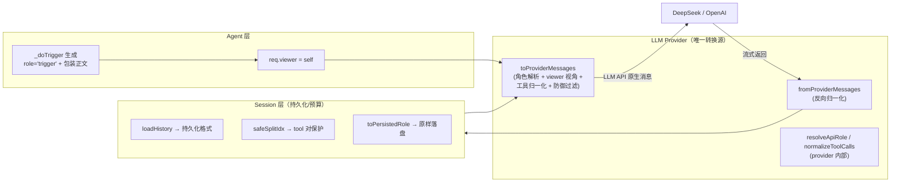

# 会话消息角色体系：从 BUG 排查到系统重构报告

> **历史复盘报告**：记录 2026-08-02 当时的事实，文中的源码路径属于旧结构，仅供追溯，不代表当前代码。
> 日期：2026-08-02
> 范围：AgentChat 消息持久化 / 归档 / LLM 上下文构建的完整整改
> 关键字：悬空消息、trigger 误标、A→A 自对话、角色一等化、provider 双向转换、viewer 视角

---

## 1. 背景与目标

AgentChat 是多 Agent 协作系统：Agent 之间、Agent 与人类用户之间通过持久化 JSONL 会话文件
（`messages.jsonl` + `archive/history_N.jsonl`）交换消息，并由 LLM（DeepSeek / OpenAI 兼容）驱动推理。

运行一段时间后出现一系列**数据健康问题**：大量 OpenAI 告警（孤立 tool / 悬空 tool_calls / 空 assistant）、
归档后消息角色错乱（agent 消息变成 trigger）、A→A 自对话堆积连续 trigger 墙等。
本报告记录从「症状 → 根因 → 修复 → 架构重构」的完整过程，并单独分析**异常边界**（系统中断等
非常规触发手段产生的数据形态）。

最终目标：**让消息角色/视角的判定有且只有一个事实来源**，且判定依据是**角色字段而非正文内容**。

---

## 2. BUG 发现与处理（按时间线）

### 2.1 悬空消息：孤儿 tool / 悬空 tool_calls / 空 assistant

**症状**：运行日志持续出现三类 OpenAI 兼容 API 的 400 前置告警：

```
⚠️ 已过滤孤立 tool 消息 tool_call_id="call_..."（防 API 400）
已过滤悬空 tool_calls assistant（期望 2 个 tool，实际 1 个）
已过滤空 assistant 消息（防 API 400）
```

**成因**：
- **孤儿 tool**：tool 消息的 `tool_call_id` 在历史中找不到对应的 `assistant.tool_calls`（配对断裂）。
- **悬空 assistant**：assistant 声明了 N 个工具调用，但历史里只有 M<N 条 tool 结果（推理被中断）。
- **空 assistant**：Agent 静默回复（判断"无需回复"）或中断收尾产生的无内容、无工具调用、无思考的消息。

**处理**：
1. 统一维护脚本 `session-maint.js scan --fix` 批量清理存量数据（孤儿 tool / 悬空对 / 空 assistant）。
2. postHook 持久化时**跳过空 assistant**，从源头杜绝空消息落盘。
3. provider 的 `toProviderMessages` 保留三重防御过滤（空 assistant / 孤立 tool / 悬空 tool_calls），
   即便历史仍有异常也能在发往 API 前兜底。

### 2.2 trigger 消息带工具调用

**症状**：`role='trigger'` 的消息竟然携带 `tool_call_id`（工具结果特征）。

**根因**：归档重建时用**正文内容嗅探**判定角色——`content.includes('<trigger>')` 命中了
`query_history` 工具的输出（其内容内嵌了历史对话里的 `<trigger>` 文本），把工具结果整条改写成了 trigger。

**处理**：`toPersistedRole` 不再对 tool/error 做任何内容改写（工具结果保持原角色），
后续进一步改为**纯角色判定**（见 §4）。

### 2.3 A→A 自对话：连续 trigger 墙

**症状**：Agent 与自己对话（系统自主触发：报时 / 定时 / 记忆审查 / 归档整理）时，历史堆积
「连续 user trigger」消息墙，且 Agent 常对 trigger 静默 → 空回复 + 触发 2.1 的空 assistant 告警。

**处理**：**A→A 自对话永不落盘消息历史**（postHook 早退：仅记录用量、清空本轮缓存），
自对话不再污染持久化与上下文；存量 A→A 历史由 `session-maint.js aa` 清理。

### 2.4 脚本泛滥

**症状**：历史消息处理脚本多达 8 个（`clean-orphans.js` / `find-orphans.js` / `scan-dangling.js` /
`cleanup-archive.js` / `cleanup-all-archives.js` / `clean-sessions.py` / `clean-history-exceptions.js` ...），
大多雷同、维护成本高。

**处理**：合并为统一入口 **`scripts/session-maint.js`**（子命令 `scan` / `aa` / `compact` / `all`），
运行时脚本移入 `scripts/runtime/`。

### 2.5 核心 BUG：归档后 agent 消息变成 trigger 消息

**症状**：用户观察到归档重建后，**Agent 的回复消息被改写成了 trigger**。

**根因**（层层深入）：
1. `toPersistedRole` 对所有角色都做 `content.includes('<trigger>')` 判定；
2. Agent 回复**讨论/引用了 `<trigger>` 字样**（例如"归档重建用 `<trigger>` 子串做检测"）即被误标；
3. 本质问题：**角色判定依赖正文内容，而非 `role` 字段**——但当时内存角色模型里根本不存在
   `role='trigger'`（trigger 只存在于持久化层，由内容反推而来），导致「先有内容后定角色」的循环。

**处理**：
- 修复 `toPersistedRole`：仅对入站 `user` 且 `startsWith('<trigger>')` 判定；assistant 永不改写。
- 用 `session-maint.js scan --fix` 批量修复存量误标（共 199 条）。
- **根因级修复**：让 `role='trigger'` 成为内存一等角色，角色判定彻底脱离正文内容（见 §4）。

---

## 3. 根因总结

| 层次 | 问题 | 根因 |
|------|------|------|
| 数据层 | 孤儿 tool / 悬空 / 空 assistant | 中断产生的残缺轮次；静默回复落盘 |
| 角色层 | trigger 带工具调用 / agent 变 trigger | **正文内容嗅探**判定角色 |
| 会话层 | A→A trigger 墙 | 自对话被持久化 |
| 架构层 | 视角/角色转换散落多处 | `resolveRole`（会话层）、`toPersistedRole`（归档）、provider 映射各自实现 |
| 架构层 | Agent 拼装 LLM 消息 | 角色/视角/过滤逻辑耦合在 Agent 循环里 |

核心洞察：**「角色」应当由数据本身（role 字段）决定，正文只负责 LLM 渲染；而「视角」
（user/assistant 归属）应当是 provider 依据当前 viewer 统一推导，而非在加载历史时固化。**

---

## 4. 系统重构（分三步收拢）

### 4.1 重构一：trigger 一等角色

- `MessageRole` 增加 `'trigger'`（`system | user | assistant | tool | error | trigger`）。
- `_doTrigger` 创建消息时 `role='trigger'` + 正文保留 `<trigger>hint</trigger>` 包装
  （包装仅为 LLM 渲染约定 + 旧数据兼容，不再用于角色判定）。
- `loadHistory` 加载 `trigger` 原样保留（不再降级为 `user`）。
- `toPersistedRole` / postHook 全部改为**依据 `role` 字段**判定，删除所有 `startsWith('<trigger>')` 嗅探。

### 4.2 重构二：chat/stream 接收持久化格式 + 视角转换下放 provider

- `LLMRequest.messages` 类型改为 `LLMRequestMessage[]`（持久化格式 `role='agent'` 与内存格式可混排）。
- `loadHistory` 返回**持久化格式**（不再做视角转换，`resolveRole` 删除）；
  旧数据 `user/assistant` 归一化为 `agent`；`trigger+tool_call_id → tool` 仅作为历史损坏修复保留。
- `toProviderMessages` 依据 `assistant=self Agent ID` 做视角转换（自己发 → assistant / 对方 → user）。

### 4.3 重构三：双向转换收拢 provider + viewer 视角

- **删除独立 `message-role.ts`**，`resolveApiRole` / `normalizeToolCalls` 收拢进 `src/llm/openai.ts` 内部。
- provider 拥有**双向转换**：
  - `toProviderMessages(messages, viewer?)`（正向）：项目消息 → LLM API 原生消息；
  - `fromProviderMessages(messages)`（反向）：LLM API 原生消息 → 项目消息（OpenAI tool_calls 归一化）。
- 视角字段改名 **`viewer`**（当前视角 Agent ID），规则：`agent_id === viewer → assistant`，
  `agent_id !== viewer → user`，`agent_id === 'user'` 恒为 user——**1:1 与群聊共享历史通用**。
- 会话层截断/归档改为**纯结构判定**（`safeSplitIdx`：tool 消息回退到配对 agent 之前，防拆 tool 对），
  不再做任何角色/视角解析；`summary` 复用 `toProviderMessages` 渲染 LLM 视角。

### 4.4 重构后职责边界

| 层 | 职责 | 关键代码 |
|----|------|----------|
| Agent | 生成 trigger（一等角色）；携带 `viewer=self` | `_doTrigger` / `req.viewer` |
| Provider | **唯一**的角色/视角/工具归一化/防御过滤；双向转换 | `toProviderMessages` / `fromProviderMessages` |
| Session | 持久化（持久化格式原样存取）；token 预算；tool 对保护（结构判定） | `loadHistory` / `safeSplitIdx` / `toPersistedRole` |

---

## 5. 异常边界分析（非常规触发手段）

部分异常**并非由常规用户对话产生**，而是来自**系统中断等非常规触发手段**，需在设计与数据修复中
单独对待：

### 5.1 系统自主触发（定时器 / 群通知 / 记忆审查 / 归档整理）
- 形态：`_doTrigger(wrap=true)` → `role='trigger'`，正文 `<trigger>...</trigger>`。
- 风险：若按正文判定角色，Agent 回复中引用 `<trigger>` 字样会被误标（2.5 的核心 BUG）。
- 处理：角色由 `role='trigger'` 权威判定；正文包装仅为 LLM 渲染约定。

### 5.2 A→A 自对话（Agent 与自己）
- 形态：无 target 的 `trigger` → `sender === receiver`。
- 风险：连续 trigger 墙 + 静默空回复 + 上下文污染。
- 处理：postHook 对 A→A **永不落盘**，只记录用量。

### 5.3 重启恢复 / reload 续推
- 形态：`restart-continue` trigger（重启后入队重投）、`reload-requested` 后 reinit 续推。
- 风险：中断时可能留下残缺轮次（悬空 tool_calls / 空 assistant）。
- 处理：provider 防御过滤兜底；reload 清空 `currentMessage` 防重复持久化。

### 5.4 静默回复（Agent 判断无需回复）
- 形态：空 content / 无 tool_calls / 无 reasoning 的 assistant。
- 处理：postHook 跳过落盘 + provider 空 assistant 过滤。

### 5.5 历史数据损坏（历史上误标）
- 形态：`role='trigger'` 但带 `tool_call_id`（`query_history` 结果曾以 trigger 落盘）。
- 处理：`loadHistory` 加载时 `trigger+tool_call_id → tool`（保证配对完整）；
  `session-maint.js` 扫描也只认这一种损坏特征，其余 `role='trigger'` 一律信任。

### 5.6 无视角信息（viewer 缺失）
- 形态：持久化 `role='agent'` 但未传 `viewer`（如摘要等不关心视角的路径）。
- 处理：`resolveApiRole` 安全回退 `→ user`（视角未知视为入站），避免越权推断。

### 5.7 群聊共享历史
- 形态：多人共享 `role='agent'` 消息，归属由 `agent_id` 标记。
- 处理：视角判定统一用 `viewer`（正在查看共享历史的 Agent）；对方消息封装 `<msg from=...>` 由
  `loadGroupHistory` 在展示层处理，不参与 provider 视角转换。

---

## 6. 最终架构（数据流）



### 角色判定唯一事实来源
- **创建**：Agent 用 `role='trigger'` / `role='user'` 标记（一等角色）。
- **持久化**：`toPersistedRole` 按 `role` 字段直接映射，零内容嗅探。
- **加载**：`loadHistory` 返回持久化格式，`trigger+tool_call_id→tool` 仅处理历史损坏。
- **发往 LLM**：provider `resolveApiRole(role, agent_id, viewer)` 统一推导（含视角转换）。
- **展示**：前端 `isTrigger` 优先 `role==='trigger'`，旧数据回退内容检测。

---

## 7. 验证

| 项目 | 结果 |
|------|------|
| `npx tsc --noEmit --pretty false` | ✅ 无错误 |
| `npx vitest run` | ✅ 8 文件 / 59 测试通过（含 `toProviderMessages` / `fromProviderMessages` 双向用例、`loadHistory` 持久化格式、`toPersistedRole` 角色映射、`truncateTail` 截断保护） |
| `node scripts/session-maint.js migrate --fix` | ✅ 幂等（迁移后 0 行改动；首轮迁移 254 行/13 文件） |
| `node scripts/session-maint.js scan` | ✅ 孤儿 0 / 悬空 0 / 空 assistant 0 / trigger 误标 0 |
| 前端 `vue-tsc + vite build` | ✅ 构建通过 |
| `start.bat` 启动前迁移 | ✅ 自动执行 `migrate --fix`（容错：缺失/失败仅告警不阻塞） |

---

## 8. 结论与遗留

**结论**：通过「trigger 一等角色化 + 角色判定脱离正文 + 视角/转换收拢 provider + viewer 统一视角 +
会话层结构判定」四步整改，消息角色体系从"内容嗅探、分散实现、易误标"收敛为
「**创建标记 → 持久化原样 → provider 统一解析**」的单向清晰链路，并天然兼容系统中断、
A→A 自对话、群聊、历史损坏等异常边界。

**已落地（2026-08-02 第二轮，A1–A4 / B1–B3 / C1）**：
- **A1 群聊收拢**：`loadGroupHistory` 保留持久化 role（agent/tool/trigger/error/system），仅对
  非当前视角（agent_id≠viewer）的 agent 消息封装 `<msg>` 标签；trigger 不再套 `<msg>`；
  `truncateGroupHistory` 改用 `safeSplitIdx`。1:1 与群聊共用 provider 的 viewer 视角体系。
- **A2 反向路径**：`_runStream` 返回前经 `fromProviderMessages` 反向归一化（OpenAI tool_calls →
  简化 ToolCall），`buildToolCalls` 删除，反向转换唯一入口收拢在 provider。
- **A3 协议依据**：`toProviderMessages` 对 user 视角丢弃 tool_calls 的注释补充协议依据
  （user 不能携带 tool_calls；tool 必须紧跟匹配 assistant）。
- **A4 数据迁移**：新增 `session-maint.js migrate` 子命令（user/assistant→agent、
  trigger+tool_call_id→tool，幂等，覆盖 sessions+groups），已执行（254 行归一化 / 13 文件）；
  `loadHistory`/`loadGroupHistory` 移除运行时归一化，改原样透传持久化 role。
- **B1 A→A 收窄**：postHook 对 A→A 仅跳过「消息持久化 + 空闲定时器重置」，其余（延迟刷新/
  压缩标记/归档检测/用量）正常走。
- **B2 缓存依据**：`safeSplitIdx` 保留所有 tool 对，注释补充 DeepSeek prompt 缓存命中依据。
- **B3 共享估算**：token 估算收拢到 `src/utils/tokens.ts`，`history.ts` 再导出，
  `webui/server` 复用同一实现（消除重复），并修正 `/tokens` 端点硬编码 1M → 读取真实
  `extension.agent_session.maxContextTokens`。
- **C1 前端纯角色**：`Message.vue` `isTrigger` 改为纯 `role==='trigger'`（移除正文回退）；
  `chat.start` 事件后端显式下发 `isTrigger`，前端 `chat.ts` 不再用正文 `<trigger>` 嗅探。
- **启动集成**：`scripts/runtime/start.bat` 在启动前后端服务前自动执行
  `scripts/session-maint.js migrate --fix`（幂等、容错：缺失/失败仅告警不阻塞启动）；
  `scripts/build-release.ts` 打包时同步复制 `session-maint.js` 到 release，保证发布版同样具备
  「先修复数据再启动」能力。

**遗留/后续可选项**：
- 群聊 `<msg>` 标签为 agent-prompt 提示约定，若提示词调整需同步 `loadGroupHistory` 的封装逻辑。
- `start.bat` 已自动执行 `migrate --fix`（幂等，每次启动零开销）；非 `start.bat` 入口
  （如 `npm start` / 开发直启）接入存量/备份数据时，可手动执行一次 `session-maint.js migrate --fix`。
- 空 assistant 等数据卫生仍依赖 `session-maint.js scan` 定期巡检（可挂到 `all`）。
