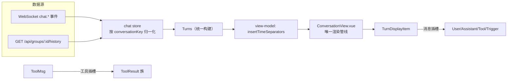

# WebUI v2 —— 数据/UI 解耦 + 插槽式扩展框架

> 目标：解决 v1 前端「UI 与数据耦合严重、加功能要改多处框架代码」的问题。
> 方案：新建独立可运行的 `src/ui/webui-v2`，数据层纯数据、UI 层插槽驱动，
> 增量功能只需「注册」即可接入，框架本体零改动。

## 1. 分层架构

```
src/ui/webui-v2/src/
├── domain/        # 纯数据层（零 Vue/Pinia/DOM 依赖，可单测）
│   ├── types.ts       # 纯数据模型（ChatMessage/Turn/AgentInfo/GroupInfo…）
│   ├── turns.ts       # Turn 构建纯函数（agentMsgsToSteps/buildTurnsForHistory）
│   ├── history.ts     # 历史分页合并（mergeHistoryPage）
│   ├── format.ts      # 纯格式化函数
│   ├── toolResult.ts  # 工具结果解析（parseToolResult）
│   └── protocol.ts    # WS 消息类型常量 + 构建/解析
├── services/      # 服务层（纯 TS）
│   ├── websocket.ts   # WebSocketClient（重连+积压+多 handler）
│   └── api.ts         # 类型化 REST API 客户端（收拢散落 fetch）
├── stores/        # 状态层（Pinia，只持有数据与动作）
│   ├── chat.ts        # ★ 统一会话 store（agent + group 收敛为一套管线）
│   ├── agents.ts      # Agent 列表
│   ├── groups.ts      # 群组列表
│   ├── ui.ts          # 视图状态（视角/面板可见性/宽度）—— 与数据 store 分离
│   ├── theme.ts       # 主题
│   └── websocket.ts   # WS 连接状态（薄封装）
├── framework/     # ★ 插槽框架（扩展点）
│   ├── registry.ts        # 通用有序注册表
│   ├── perspectives.ts    # 布局插槽（视角注册）
│   ├── messageViews.ts    # 消息渲染插槽（按 kind 分发）
│   └── toolResultViews.ts # 工具结果渲染插槽（按工具名分发）
├── shell/         # 布局壳（全部由插槽驱动）
│   ├── AppShell.vue      # 活动栏 + 列表面板 + 主区 + 弹窗层
│   ├── ActivityBar.vue   # 视角图标
│   ├── ListPanel.vue     # 列表面板（统一宽度拖拽）
│   └── ModalLayer.vue    # 弹窗层
├── perspectives/  # 视角装配入口
│   ├── index.ts         # 汇总注册
│   ├── chat.ts          # 会话视角（核心）
│   ├── workspace.ts     # 工作区视角
│   └── settings.ts      # 设置视角
├── views/         # 视图组件
│   ├── chat/            # 统一会话（ConversationView + 消息视图族 + 工具结果族）
│   ├── workspace/       # 工作区
│   └── settings/        # 设置
└── view-model/    # 渲染视图模型（DisplayItem / 时间分隔符，属于 UI 层）
```

## 2. 数据层解耦（domain = 纯数据，无 UI 相关）

**铁律**：`domain/` 不 import 任何 Vue/Pinia/DOM 模块；只描述「会话数据长什么样」，
不含任何渲染概念。

| 对比项 | v1（耦合） | v2（解耦） |
|---|---|---|
| 类型位置 | `types/index.ts` 混着 UI 概念（`DisplayItem`、`_meta`、`_archived_context`） | `domain/types.ts` 纯数据；渲染概念移到 `view-model/` |
| 消息角色 | 前端 `ChatMessage.role` 只含 agent/tool/trigger，与后端漂移 | 复用 `@shared/types` 契约（PersistedMessage/ToolCall），单源防漂移 |
| Agent 字段 | 前端用 `id`、后端返回 `id`，shared 却用 `agent_id`（三处不一致） | domain 以真实传输契约为准（`id`），注释说明为何不复用 shared |
| 瞬态状态 | `isStreaming/status/isError` 直接塞进消息对象 | 保留在数据层但语义明确为「流式运行时状态」，与 UI 布局概念（展开/折叠/宽度/主题）严格分离 |
| 双渲染管线 | ChatView（chat store 流式）+ GroupChat（本地 rawMessages）两套 | **统一会话 store**：按 `conversationKey`（`agent:<id>` / `group:<id>`）归一化，一套 turns/分页/时间分隔符 |
| 散落 fetch | 组件直接 fetch（Groups/Agents/Config/Version…） | `services/api.ts` 类型化收拢 |
| 纯函数 | 埋在 store 里难测 | `domain/turns.ts` / `domain/history.ts` 纯函数可单测 |

### 统一会话管线（v2 核心收敛）



## 3. 插槽式扩展框架（增量加功能 = 注册，不改框架）

### 3.1 布局插槽 —— Perspective（视角）

一个「视角」= 完整一屏体验：活动栏图标 + 列表面板 + 主视图 + 全局弹窗。

**新增一个视角只需：**

```ts
// perspectives/community.ts
import { registerPerspective } from '@/framework/perspectives';
import CommunityList from '@/views/community/CommunityList.vue';
import CommunityMain from '@/views/community/CommunityMain.vue';

registerPerspective({
  id: 'community',
  label: '社区',
  order: 40,
  icon: '<svg …星图图标…>',
  list: CommunityList,     // 可空：该视角无左侧列表
  main: CommunityMain,     // 必填
  modals: [CommunityDetail], // 该视角挂载的全局弹窗
});
```

然后在 `perspectives/index.ts` 加一行 `import '@/perspectives/community';`。
`AppShell`/`ActivityBar`/`ListPanel`/`ModalLayer` 全部自动适配，**零改动**。

### 3.2 消息渲染插槽 —— MessageView

`TurnDisplayItem` 不再写死分支，按消息 kind（`user/assistant/tool/trigger`）
从 `messageViews` 注册表取组件。

**新增消息类型只需：**

```ts
// views/chat/messages/xxx.ts
registerMessageView('assistant', MyCustomAssistant);
```

（`messages/index.ts` 里已注册默认四件套；同名覆盖即可替换默认实现。）

### 3.3 工具结果渲染插槽 —— ToolResultView

`ToolMessage` 按工具名从 `toolResultViews` 注册表取组件，未知工具回退 `*`（fallback）。

**新增工具展示只需：**

```ts
// views/chat/toolResults/xxx.ts
registerToolResultView('my_tool', MyToolResultView);
```

（`toolResults/index.ts` 已注册 read/write/edit/bash/web/browser/subagent 等。）

### 3.4 插槽注册表（framework/registry.ts）

```ts
class SlotRegistry<T> {
  register(entry)   // 有序、按 id 去重、同名覆盖
  get(id) / has(id)
  all()             // 按 order 升序
  unregister(id)    // 插件卸载
}
```

三种插槽均为该注册表的特化，扩展语义统一。

## 4. 如何运行

```bash
# 后端（3830）已在运行的前提下：
cd src/ui/webui-v2
npm install
npm run dev        # http://localhost:3832 （proxy /api /ws → 3830）
npm run build      # vue-tsc 类型检查 + vite 打包到 dist/
```

与 v1（`src/ui/webui`，端口 3831）完全独立，可同时运行。

## 5. 已验证功能（浏览器实测 2026-08-09）

- ✅ 视角切换：会话 / 工作区 / 设置（活动栏插槽驱动）
- ✅ 统一会话列表：Agent + 群组混排、搜索、时间排序
- ✅ 单 Agent 会话：历史加载、流式发送、思维链折叠、Token 占用、复制/重新推理/删除
- ✅ 群聊：历史加载、发送、参与者信息（与单 Agent 共用同一 ConversationView）
- ✅ 工具结果渲染：bash 终端质感、read 代码预览（插槽分发）
- ✅ 工作区树：递归目录展开、文件预览入口
- ✅ 设置视角：主题切换、全局配置 / Token 用量 / 版本弹窗、Agent 配置
- ✅ 构建：`vue-tsc --noEmit` + `vite build` 全绿

## 6. 已知限制 / 后续建议

- 群聊的「重推理/删除」等动作暂不启用（与 v1 一致，只读展示）
- `GlobalSettings` / `AgentSettings` 为 JSON/简表编辑，schema 驱动表单可后续以
  MessageView 同类插槽扩展
- `useMarkdown` 单例在组件间共享，未来可考虑注入式（composable 参数化）
- `chat.ts` 仍较长（流式事件处理密集），可再拆为 `chat.store.ts`（状态）
  + `chat.events.ts`（事件分发表），但已按 conversationKey 归一化，具备拆分前提
