# Run 生命周期：临时态与收敛 checkpoint 全景

> 背景：cr-106 吸收事故暴露的体系级缺口——前端「临时态等收束拉直」依赖 run 必然收束，
> 而收敛 checkpoint 只有 after-run / run-settled 两个（外加发送侧 watchdog 一个孤立兜底）。
> 悬挂 run（进程卡死、无收尾帧）期间切走切回，中间态只能靠 mergeHistory 的对齐猜测消化。
> 本图以 single 会话一轮 run 为例，标出每个阶段产生的临时态与现有/候选收敛点，
> 供评估是否加 checkpoint。时序主轴 = 后端事件序，右侧标注前端分区态与临时态。
>
> **核实注记（2026-10-06 文档治理）**：本文为**现行**架构描述，未被取代——已对照源码与 cr-log 逐项核实：
> cr-106 身份门 + 空载门在场（`ac-client-ui-conversation/client/feed-core.ts` 吸收段）；cr-107 checkpoint-B
> （live 分区禁指纹短路，`feed-core.ts` requestHistoryPage 双门）与 checkpoint-C（悬挂流探针 180s +
> `conversation/stats` 权威判死活 + `convergeDialog(id, true)` 强制收敛）在场，回归测试
> `src/webui/tests/feed-converge-checkpoints.test.ts`。候选 A/D 为 cr-107 已裁决不做项（历史裁决，非待办）。
> 另：run 收束重拉的两驱动为 `session/run-settled`（delay 0，cr-94）+ `loop/after-run` +500ms 兜底（本文
> 落点行「feed-core」成文于三文件化之前，journal 行读侧合并在 `ac-session` `records()` 内完成——见
> `session-design.md` §7/§8）。

## 一、时序图（正常路径）

```mermaid
sequenceDiagram
    autonumber
    participant U as 用户（webui）
    participant F as feed/chat core<br/>(前端分区)
    participant W as ws-bridge<br/>(事件广播)
    participant C as conversation<br/>(串行化门+队列)
    participant R as router
    participant L as agent-loop
    participant S as ac-session<br/>(journal/落盘)
    participant P as LLM provider

    U->>F: sendMessage
    Note over F: 本地用户行上屏（乐观）<br/>d.streaming=true<br/>armSendWatchdog(30s)
    F->>C: conversation/deliver RPC
    C->>R: 空闲 → router.send
    R->>S: emit router/message-received
    Note over S: 用户行入队+flush<br/>（agent_id=user）
    W-->>F: router/message-received（回显）
    Note over F: showOwnEcho：在场判定→跳过
    R->>L: 信封投递（runId 铸造）

    rect rgb(40,40,60)
        Note over L,P: 步循环 k=1..N（每步重复 ⑧~⑮）
        L->>P: dispatch（请求）
        W-->>F: loop/step-started
        Note over F: 建流式占位（空！）<br/>★事故窗：占位空内容
        P-->>L: delta 流（reasoning/text/toolCalls）
        W-->>F: llm/delta（30ms 微批）
        Note over F: carrier 按步定位原地追加<br/>工具分片→preparing 占位卡
        L->>S: after-step → journal-step 落盘
        W-->>F: loop/after-step（步终值全量替换）
        Note over S: partials.jsonl 增长
        L->>L: 工具执行（before-execute flush）
        W-->>F: tool/started · after-execute
        Note over F: 工具卡 running→终值<br/>（300ms 最短转圈）
    end

    L-->>R: LoopRunResult
    W-->>F: loop/after-run
    Note over F: closeAllStreaming<br/>final 物化（强生命周期）
    R->>S: reply-completed → settlement
    Note over S: ①提升批 append（durable）<br/>②journal 剔除
    S->>W: emit session/run-settled
    W-->>F: session/run-settled
    Note over F: ★checkpoint-2：重拉首屏<br/>权威行整体替换临时态
    F->>S: session/history
    S-->>F: 权威收束行（含 persistedMsgId）
    Note over F: 一切临时态拉直（吸收/悬置<br/>final/占位全被替换）
```



## 二、临时态清单（谁在等哪个 checkpoint 拉直）

| 临时态 | 产生时刻 | 消费/拉直时刻 | 悬挂 run 时命运 |
|---|---|---|---|
| 本地用户行（乐观上屏，无锚） | sendMessage | 首屏合并的 anchor 保护 / settlement 重拉 | 落盘行已正确，靠合并对齐 |
| 流式占位（isStreaming，**先建空**） | step-started | after-step / after-run / closeAllStreaming | **永悬**——空载即事故根因 |
| preparing 工具卡（参数流式段） | 首个工具分片 | delta-end 升级真 id / after-execute 填终值 | 永悬转圈 |
| final 悬置（null） | run 开始 | after-run 物化 | 永悬 = 步骤流一直裸露 |
| 步终值/校准锚（runCalibMs） | after-step | 下一步 after-step / settlement | 定格旧值 |
| 吸收合并（mergeHistory 对齐产物） | 切回会话首屏 | settlement 重拉 | **永悬**——错误身份永不纠正 |
| journal 活投影行（partial） | records() 读侧 | settlement 提升/剔除 | 刷新后仍双源在场 |
| watchdog 30s 兜底 | sendMessage | 到点查无占位即回落 | 有占位恒不触发——**盲区** |

## 三、现有收敛点与候选 checkpoint

```mermaid
flowchart LR
    subgraph 现在
        A[checkpoint-1<br/>after-run<br/>帧边界] --> B[checkpoint-2<br/>run-settled<br/>durable 落盘]
        B --> C[重拉首屏<br/>权威替换]
        WD[watchdog 30s<br/>孤立·只回落标志] -.不触发重拉.-> C
    end
    subgraph 候选（讨论用）
        D1[checkpoint-A<br/>每步 after-step<br/>即步级对账] --> C
        D2[checkpoint-B<br/>切回会话时<br/>无条件重拉] --> C
        D3[checkpoint-C<br/>watchdog 到点<br/>触发权威化] --> C
        D4[checkpoint-D<br/>step 间静默超时<br/>（LLM 往返级）] --> C
    end
```

### 裁决（cr-107 已实施 B + C）

| 候选 | 收敛什么 | 状态 |
|---|---|---|
| A·after-step 步级重拉 | 步间一致性 | 不做：步粒度过细、RPC 放大，收益有限 |
| **B·切回会话重拉** | 切回时点的双源错位 | **已实施**：live 分区（流式/占位/未闭合工具行）首屏禁指纹短路，切回必全量——切回时点成为第三个一等收敛点 |
| **C·悬挂流探针 + watchdog 权威化** | 悬挂 run 的永悬临时态 | **已实施**：streaming 分区静默 3min → conversation/stats 权威判死活（判死=关停+强制收敛 / 判活=顺延 / RPC 失败=不定罪）；watchdog 触发即 convergeDialog(force) |
| D·step 间静默超时 | 更早发现悬挂 | 不做：与 LLM 超时/重试语义纠缠，误伤慢模型 |

> 落点：feed-core（lastStreamAt 基线 / scheduleStaleProbe / convergeDialog / fingerprint 双门）+ chat-core（watchdog 收敛）。
> 测试：src/webui/tests/feed-converge-checkpoints.test.ts（B 两态 + C 三分支）。
> mergeHistory 对齐猜测保留为纵深防御（B 的重拉到达前仍有一屏窗口）。
